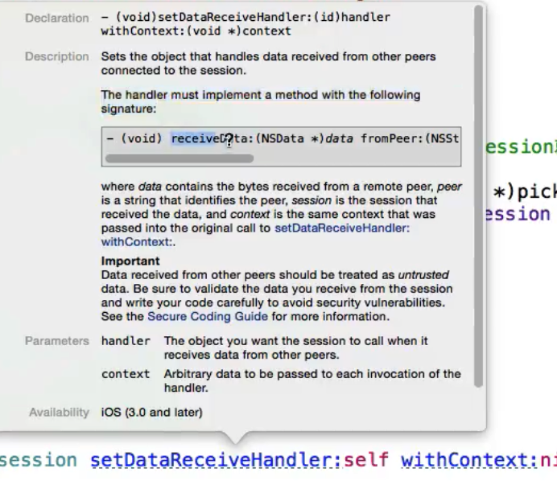

#Chapter-20（II）蓝牙交互GameKit

---
```objc
Update更新：2016年5月18日 By {MISSAJJ琴瑟静听}
```
###简介：
* 实现蓝牙设备之间的`通讯`
* 只能使用在`iOS设备`之间`同一个应用`内连接
* 从`iOS7`开始过期了
* 但是GameKit是`最基本的`蓝牙通讯框架
* 通过蓝牙可以实现文件的共享（仅限设备沙盒中的文件）
* 此框架一般用于游戏开发（比如五子棋对战）

##开始案例
###简介：
* 使用蓝牙将两个iOS设备连接起来
* 搜索对方的设备
* 实现将手机中的图片发送给对方

###界面的搭建：
###蓝牙互连：
* 搜索蓝牙设备

```
	// 初始化链接蓝牙控制器
    GKPeerPickerController *peerCtr = [[GKPeerPickerController alloc]init];
    // 显示匹配到的蓝牙设备
    [peerCtr show];
```
* `GKPeerPickerController`最重要的两个代理

```
/**
 *  链接成功
 *
 *  @param picker  蓝牙控制器
 *  @param peerID  连接蓝牙的设备id
 *  @param session 连接蓝牙的会话（通讯）用来传数据
 */
- (void)peerPickerController:(GKPeerPickerController *)picker didConnectPeer:(NSString *)peerID toSession:(GKSession *)session
{
    NSLog(@"%s %d",__func__,__LINE__);
    // 隐藏蓝牙控制器
    [picker dismiss];
}

// 退出连接
- (void)peerPickerControllerDidCancel:(GKPeerPickerController *)picker
{
    NSLog(@"%s %d",__func__,__LINE__);
}
```

###选择图片：
* 选择图片方法

```
// 选择图片
- (IBAction)chooseImage {
    // 1.初始化图片选择控制器
    UIImagePickerController *imgPicker = [[UIImagePickerController alloc]init];
    // 2.判断图库是否可用
    if ([UIImagePickerController isSourceTypeAvailable:UIImagePickerControllerSourceTypeSavedPhotosAlbum]) {
        // 3.设置图库打开的类型
        imgPicker.sourceType = UIImagePickerControllerSourceTypeSavedPhotosAlbum;
        // 4. 设置代理
        imgPicker.delegate = self;
        // 5. 打开图库
        [self presentViewController:imgPicker animated:YES completion:nil];
    }
}
```

* 选择图片控制器的代理方法

```
/**
 *  图片选择完成调用
 *
 *  @param picker 图片选择控制器
 *  @param info   选择的信息
 */
- (void)imagePickerController:(UIImagePickerController *)picker didFinishPickingMediaWithInfo:(NSDictionary<NSString *,id> *)info
{
    NSLog(@"info == %@",info);
    // 设置选择的图片为当前的显示图片
    self.showImageView.image = info[UIImagePickerControllerOriginalImage];
    // 隐藏当前选择图片控制器
    [picker dismissViewControllerAnimated:YES completion:nil];
}
```

###图片相互发送：
* 需要在连接成功代理方法中存储当前的会话

```
// 保存当前回话
    self.m_Session = session;
```

* 发送图片方法

```
// 发送图片
- (IBAction)sendImage {
    
    // 拿到需要发送出去的图片
    UIImage *image = self.showImageView.image;
    // 将图片转换成NSData类型
    NSData *imgData = UIImagePNGRepresentation(image);
    
    /**
     *  发送数据给所有匹配上的用户
     *
     *  @param GKSendDataMode 数据发送的模式：（安全/不安全模式）
     *                        GKSendDataUnreliable : 不安全模式：就像发10个传单，传单直接往人群中砸过去，能不能收到不管
     *                        GKSendDataReliable：安全模式：就像发10个传单，每一个传单都得发到路人的手上，才再发下一个传单
     *  @return
     */
    [self.m_Session sendDataToAllPeers:imgData withDataMode:GKSendDataUnreliable error:nil];
}
```

###设置图片：
* GameKit提供的接受数据是方法的回调
	* 需要监听接收传递过来的数据
		* 在连接成功代理方法中设置监听
		
	```
	
	    /** 监听传递过来的数据
	     *  setDataReceiveHandler: 由哪个对象来监听数据的接受
	     *  withContext ： 监听需要传递的参数
	     */
	    [session setDataReceiveHandler:self withContext:nil];
    
	```
		
	* 实现监听方法
		* 只设置由谁监听传递过来的数据还是不足的，因为我们还是不能拿到传递过来的数据，进入监听方法的头文件可以看到
			
		```
			// SEL = -receiveData:fromPeer:inSession:context:
		```
		* 所以我们必须实现这个方法才能拿到接收到的数据，这个回调方法方法在Xcode 7之前的版本的解释如图：


```
/**
 *  实现接收数据的回调方法
 *
 *  @param data    接收到的数据
 *  @param peer    传递数据的设备ID
 *  @param session 当前回话
 *  @param context 注册监听传递过来的数据
 */
- (void) receiveData:(NSData *)data fromPeer:(NSString *)peer inSession: (GKSession *)session context:(void *)context
{
    // 因为传递过来的是图片，所以我们直接使用UIImage来接受
    UIImage *image = [UIImage imageWithData:data];
    // 设置图片
    self.showImageView.image = image;
}

```


