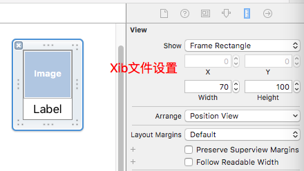

#Chapter-21 使用Xib引入模型的自定义控件案例

---
```objc
Update更新：2016年5月20日 By {MISSAJJ琴瑟静听}
```

###Xib的创建和设置：

- 1,创建Xib文件


- 2,创建与Xib对应的类文件

(注意:必须要和Xib文件同名)


- 3,创建与Xib对应的类文件

  

###Xib的使用注意点：
 
Xib只能描述软件界面,必须创建一个类管理这个xib,xib文件会被打包到应用程序中

- 1.不能通过alloc]init创建
- 2.通常提供类方法 
- 3.不会init和initWithFrame 
- 4.会执行initWithCoder和awakeFromNib


###Xib的加载方式：
- 1.如果一个View是从xib中加载出来的,没有设置尺寸,那么在xib中描述的尺寸,就是该View的尺寸
- 2.如果mainBundle作为参数,可以传入nil.(了解)

1、加载方式一:(常用)
```
    UIView *newsView = [[[NSBundle mainBundle] loadNibNamed:@"News" owner:nil options:nil] firstObject];
    [self.view addSubview:newsView];
```

2、加载方式二:(了解)
```
  // 注意:如果mainBundle作为参数时,传入nil也可以
    UINib *nib = [UINib nibWithNibName:@"News" bundle:[NSBundle mainBundle]];
    UIView *newsView1 = [[nib instantiateWithOwner:nil options:nil] firstObject];
    newsView1.frame = CGRectMake(0, 110, 375, 100);
    [self.view addSubview:newsView1];
```

###使用Xib引入模型的自定义控件案例

###1,Xib文件



- Xib对应的类.h文件

``` 
#import <UIKit/UIKit.h>
@class MAProduct;
@interface MAProductView : UIView

// 快速创建类方法
+ (instancetype)productView;

// 提供模型接口
@property (nonatomic, strong) MAProduct *product;

@end

```
- Xib对应的类.m文件

``` 
#import "MAProductView.h"
#import "MAProduct.h"

@interface MAProductView ()

@property (weak, nonatomic) IBOutlet UIImageView *iconView;
@property (weak, nonatomic) IBOutlet UILabel *titleLabel;

@end

@implementation MAProductView

#pragma mark - 快速通过xib创建对象的类方法
+ (instancetype)productView
{
    return [[[NSBundle mainBundle] loadNibNamed:NSStringFromClass(self) owner:nil options:nil] firstObject];
}

//设置模型传值
- (void)setProduct:(XMGProduct *)product
{
    //这一步很重要, 否则传值为空就无数据
    _product = product;
    
    // 给子控件设置数据
    self.iconView.image = [UIImage imageNamed:product.icon];
    self.titleLabel.text = product.title;
}
@end
```
- 相关注意点:


```
// 如果控件时通过xib或者storyboard加载出来的,那么就会执行该方法
// 作用:在initWithCoder方法中添加子控件
- (instancetype)initWithCoder:(NSCoder *)aDecoder
{
    if (self = [super initWithCoder:aDecoder]) {
        NSLog(@"%s", __func__);
        self.backgroundColor = [UIColor yellowColor];
    }
    return self;
}

// 所以xib中的控件都加载好之后会执行该方法
// 作用:初始化操作,比如设置背景,初始化一些数据
- (void)awakeFromNib
{
    [super awakeFromNib];
    
    self.backgroundColor = [UIColor yellowColor];
    
    NSLog(@"%s", __func__);
} 
```
- 其他注意点:


```
/*
#pragma mark - 设置数据的方法 (淘汰)
- (void)setIcon:(NSString *)iconName
{
    self.iconView.image = [UIImage imageNamed:iconName];
}

- (void)setTitle:(NSString *)title
{
    self.titleLabel.text = title;
}
*/

#pragma mark - 初始化方法 
(注意 : 使用Xib不需要初始化方法,代码创建才需要)
/*
- (instancetype)init
{
    if (self = [super init]) {
        NSLog(@"%s", __func__);
    }
    return self;
}

- (instancetype)initWithFrame:(CGRect)frame
{
    if (self = [super initWithFrame:frame]) {
        NSLog(@"%s", __func__);
    }
    return self;
}
*/
```
###2,模型文件

- 模型.h文件

```
#import <Foundation/Foundation.h>

@interface MAProduct : NSObject

// 商品的图片
@property (nonatomic, copy) NSString *icon;

// 商品的名字
@property (nonatomic, copy) NSString *title;

- (instancetype)initWithDict:(NSDictionary *)dict;
+ (instancetype)productWithDict:(NSDictionary *)dict;

@end
```
- 模型.m文件

```
#import "MAProduct.h"

@implementation MAProduct

/* 设置模型数据的一种方案:(淘汰)
- (instancetype)initWithIcon:(NSString *)icon title:(NSString *)title
{
    if (self = [super init]) {
        self.icon = icon;
        self.title = title;
    }
    return self;
}

+ (instancetype)productWithIcon:(NSString *)icon title:(NSString *)title
{
    return [[self alloc] initWithIcon:icon title:title];
}
 */
//设置模型数据的第二种方案 : (常用)
- (instancetype)initWithDict:(NSDictionary *)dict
{
    if (self = [super init]) {
        self.icon = dict[@"icon"];
        self.title = dict[@"title"];
    }
    return self;
}
+ (instancetype)productWithDict:(NSDictionary *)dict
{
    return [[self alloc] initWithDict:dict];
}

@end
```

###3, ViewController调用

- 调动代码

```
    /********************** 2.添加商品的View *****************************/
    // 1.创建商品的View
    MAProductView *productView = [MAProductView productView];
    productView.frame = CGRectMake(x, y, width, height);
    [self.shopCartView addSubview:productView];
    
    // 2.设置数据
    productView.product = self.products[index];

```
- 完整的ViewController代码

```
#import "ViewController.h"
#import "MAProduct.h"
#import "MAProductView.h"

@interface ViewController ()

// 购物车的View
@property (weak, nonatomic) IBOutlet UIView *shopCartView;

// 添加商品和移除商品的按钮
@property (weak, nonatomic) IBOutlet UIButton *removeProductBtn;
@property (weak, nonatomic) IBOutlet UIButton *addProductBtn;

// 商品的数据
@property (nonatomic, strong) NSArray *products;

@end

@implementation ViewController

- (void)viewDidLoad {
    [super viewDidLoad];
}

#pragma mark - 添加和移除商品
#pragma mark 添加商品
- (IBAction)addProduct:(UIButton *)sender {
    /********************** 1.常量 *****************************/
    // 1.1.定义一些常量
    CGFloat width = 70;
    CGFloat height = 100;
    
    // 1.2.计算常量
    CGFloat hMargin = (self.shopCartView.frame.size.width - 3 * width) / 2;
    CGFloat vMargin = (self.shopCartView.frame.size.height - 2 * height) / 1;
    NSInteger index = self.shopCartView.subviews.count;
    CGFloat x = index % 3 * (hMargin + width);
    CGFloat y = index / 3 * (vMargin + height);
    
    
    /********************** 2.添加商品的View *****************************/
    // 1.创建商品的View
    MAProductView *productView = [MAProductView productView];
    productView.frame = CGRectMake(x, y, width, height);
    [self.shopCartView addSubview:productView];
    
    // 2.设置数据
    productView.product = self.products[index];
    
    /********************** 3.判断按钮的状态 *****************************/
    // 3.1.判断添加商品的按钮状态
    sender.enabled = self.shopCartView.subviews.count != 6;
    // 3.2.让移除按钮可以点击
    self.removeProductBtn.enabled = YES;
}

#pragma mark 移除商品
- (IBAction)removeProduct:(UIButton *)sender {
    // 1.取出最后一个商品,并且移除掉
    UIView *lastProduct = [self.shopCartView.subviews lastObject];
    [lastProduct removeFromSuperview];
    
    // 2.判断按钮的状态
    // 2.1.判断移除按钮的状态
    sender.enabled = self.shopCartView.subviews.count;
    // 2.2.判断添加按钮的状态
    self.addProductBtn.enabled = YES;
}

#pragma mark - 懒加载代码
- (NSArray *)products
{
    if (_products == nil) {
        // 1.获取plist文件的路径
        NSString *plistPath = [[NSBundle mainBundle] pathForResource:@"products.plist" ofType:nil];
        
        // 2.读取plist文件
        _products = [NSArray arrayWithContentsOfFile:plistPath];
        
        // 3.将字典转成模型对象
        NSMutableArray *tempArray = [NSMutableArray array];
        for (NSDictionary *dict in _products) {
            // 3.1.创建模型对象,并且给属性赋值
            // MAProduct *product = [MAProduct productWithIcon:dict[@"icon"] title:dict[@"title"]];
            MAProduct *product = [MAProduct productWithDict:dict];
            
            // 3.2.将模型对象放入数组中
            [tempArray addObject:product];
        }
        
        _products = tempArray;
    }
    
    return _products;
}

@end
```