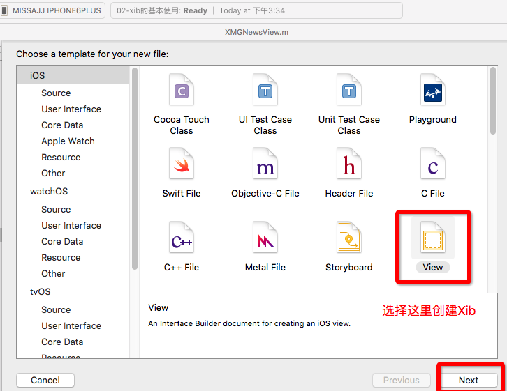
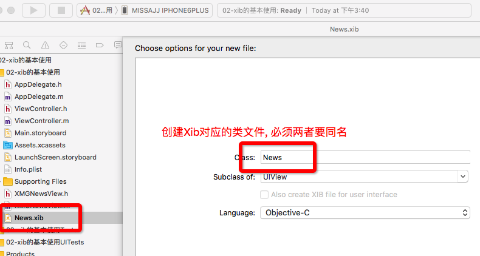
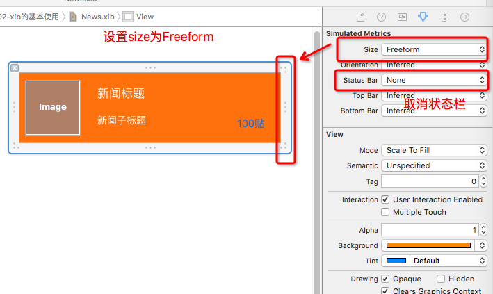

#Chapter-21 使用Xib的自定义控件

---
```objc
Update更新：2016年5月20日 By {MISSAJJ琴瑟静听}
```

###Xib的创建和设置：

- 1,创建Xib文件



- 2,创建与Xib对应的类文件

(注意:必须要和Xib文件同名)



- 3,创建与Xib对应的类文件

  

###Xib的使用注意点：
 
Xib只能描述软件界面,必须创建一个类管理这个xib,xib文件会被打包到应用程序中

- 1.不能通过alloc]init创建
- 2.通常提供类方法 
- 3.不会init和initWithFrame 
- 4.会执行initWithCoder和awakeFromNib


###Xib的加载方式：
- 1.如果一个View是从xib中加载出来的,没有设置尺寸,那么在xib中描述的尺寸,就是该View的尺寸
- 2.如果mainBundle作为参数,可以传入nil.(了解)

1、加载方式一:(常用)
```
    UIView *newsView = [[[NSBundle mainBundle] loadNibNamed:@"News" owner:nil options:nil] firstObject];
    [self.view addSubview:newsView];
```

2、加载方式二:(了解)
```
  // 注意:如果mainBundle作为参数时,传入nil也可以
    UINib *nib = [UINib nibWithNibName:@"News" bundle:[NSBundle mainBundle]];
    UIView *newsView1 = [[nib instantiateWithOwner:nil options:nil] firstObject];
    newsView1.frame = CGRectMake(0, 110, 375, 100);
    [self.view addSubview:newsView1];
```