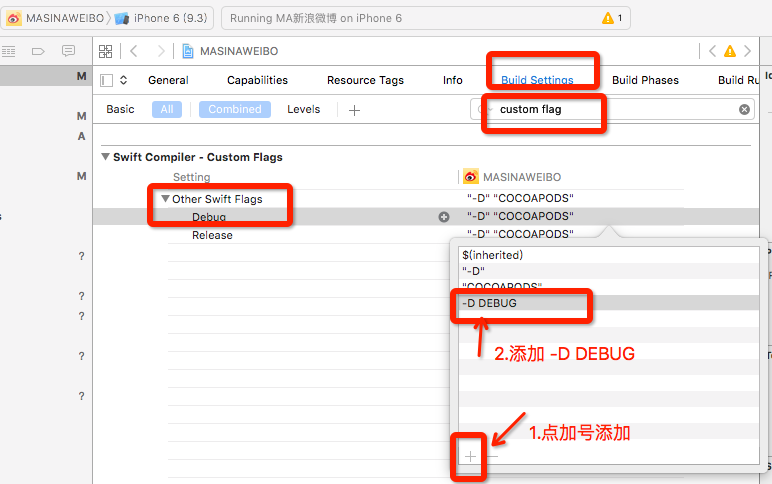

# 创建自定义Log
----
```objc
Update更新：2016年5月26日 By {MISSAJJ琴瑟静听}
  
```

 
    打印LOG的弊端:
    1.非常消耗性能
    2.如果app部署到AppStore之后用户是看不到LOG的
    
    所以
    开发阶段: 显示LOG
    部署阶段: 隐藏LOG
 
在 OC 语言中有宏定义可以简单定义 Log, 但是在 Swift 语言内是没有宏定义的, 所以我们需要通过其他办法来自定义 Log, 下面介绍几种相关自定义 Log 的工具

##1.自定义 MALog

```swift
import UIKit 
@UIApplicationMain
class AppDelegate: UIResponder, UIApplicationDelegate { 

    var window: UIWindow? 
    func application(application: UIApplication, didFinishLaunchingWithOptions launchOptions: [NSObject: AnyObject]?) -> Bool {
     
        //自定义 MALog
        MALog("test")  
        return true
    }
} 
   
    func MALog<T>(message : T, fileName: String = #file, methodName: String = #function, lineNumber: Int = #line)  {
        
        #if DEBUG  //swift 系统已经不支持宏定义了,所以需要用 DEBUG 必须在 Build Setting 搜索 custom flag, 点开 Other Swift Flags, 在 DEbug 处添加 `-D DEBUG`
            
            //    print("\((fileName as NSString).pathComponents.last!).\(methodName)[\(lineNumber)]:\(message)")
            
            print("\(methodName)[\(lineNumber)]: \(message)")
        #endif
        
    }
 ```
 
 ###自定义 MALog详解
 ```Swift
     自定义LOG的目的:
     在开发阶段自动显示LOG
     在发布阶段自动屏蔽LOG
     
     print(#function)  // 打印所在的方法
     print(#line)     // 打印所在的行
     print(#file)     // 打印所在文件的路径
     
     方法名称[行数]: 输出内容
     函数的默认值: 如果调用者没有传递对应的参数, 那么系统就会使用默认值, 如果调用者传递了参数, 那么就会使用传递的参数
     
     由于编译器可以通过赋值的类型自动推导出数据的真实类型, 所以在Swift开发中, 能不写数据类型就不写数据类型
     优点: 可以减少冗余代码
     
     泛型:
     如果想在函数中使用泛型, 那么必须告诉系统者是一个泛型函数
     func 函数名称<T>(形参列表) -> 返回值类型
     {
     }
     message : T
     T具体是什么类型由调用者来确定, 调用者传递的是什么类型, T就是什么类型
  
```

###注意: 自定义 MALog 必须自定义 Debug 标记

- 如图:在Build Setting 搜索 custom flag, 点开 Other Swift Flags, 在 DEbug 处添加 `-D DEBUG`



- 日志输出

```
application(_:didFinishLaunchingWithOptions:)[30]: test
application(_:didFinishLaunchingWithOptions:)[33]: abc
application(_:didFinishLaunchingWithOptions:)[34]: 1
application(_:didFinishLaunchingWithOptions:)[35]: 10.1
application(_:didFinishLaunchingWithOptions:)[36]: []
application(_:didFinishLaunchingWithOptions:)[37]: 123
```

##2.CocoaPods 安装日志工具 QorumLogs


- 1.编辑 Podfile: 如图内1所示,打开编辑 Podfile 文件,输入以下代码并保存关闭


```
platform :ios, '8.0'
use_frameworks!

pod 'QorumLogs'
```

- 2.点 Install Pods 安装,耐心等待直到安装完成提示重启项目,之后是在xcworkspace文件打开

```
安装完成后日志输出


/usr/local/bin/pod install

Updating local specs repositories

CocoaPods 1.0.0 is available.
To update use: `gem install cocoapods`
Until we reach version 1.0 the features of CocoaPods can and will change.
We strongly recommend that you use the latest version at all times.

For more information see http://blog.cocoapods.org
and the CHANGELOG for this version http://git.io/BaH8pQ.

Analyzing dependencies
Downloading dependencies
Using QorumLogs (0.7.2)
Generating Pods project
Integrating client project
Pod installation complete! There is 1 dependency from the Podfile and 1 total pod installed.


```

- 3.AppDelegate.swift导入头文件,并开启日志输出


```Swift
import UIKit
import QorumLogs //导入头文件

@UIApplicationMain
class AppDelegate: UIResponder, UIApplicationDelegate {

    var window: UIWindow?


    func application(application: UIApplication, didFinishLaunchingWithOptions launchOptions: [NSObject: AnyObject]?) -> Bool {
        
             // 1.初始化LOG
             
         //开关日志输出
         QorumLogs.enabled = true // 启用QorumLogs
         QorumLogs.enabled = false //项目发布之前,关闭QorumLogs
         QorumLogs.test() // 测试QorumLogs
        
        // 设置需要显示的等级
         QorumLogs.minimumLogLevelShown = 4
        
        // 测试的时候，可以限定输出文件
        QorumLogs.onlyShowThisFile(MainViewController)
        
        QL1("mylog") // debug
        QL2("mylog")  // info
        QL3("mylog") // warning
        QL4("mylog") // error
        QLPlusLine() // 打印加号作为分割线 +++++++++++++ 

        QLShortLine() // 打印等号作为分割线 ==========
        
        return true
    }
    
```
- 4.输出的日志如图显示为英文,但还不是彩色的


- 5.见证奇迹的时刻: 让日志变彩色,安装XcodeColors:


----

##3.日志插件工具下载链接
---
###日志工具QorumLogs

- 为 Xcode 和 Google Docs 设计的 Swift 日志工具。
  - 作者源代码：https://github.com/goktugyil/QorumLogs


####让你的日志变成彩色的 XcodeColors
- 很有趣的插件，可以试一下哦~
  - 作者源代码： https://github.com/robbiehanson/XcodeColors


