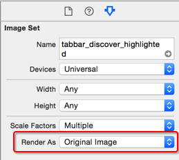
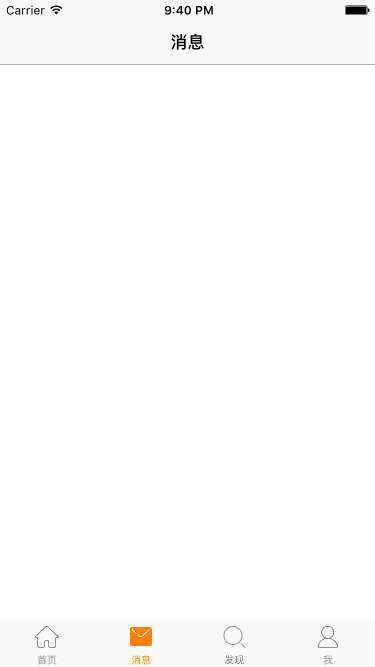
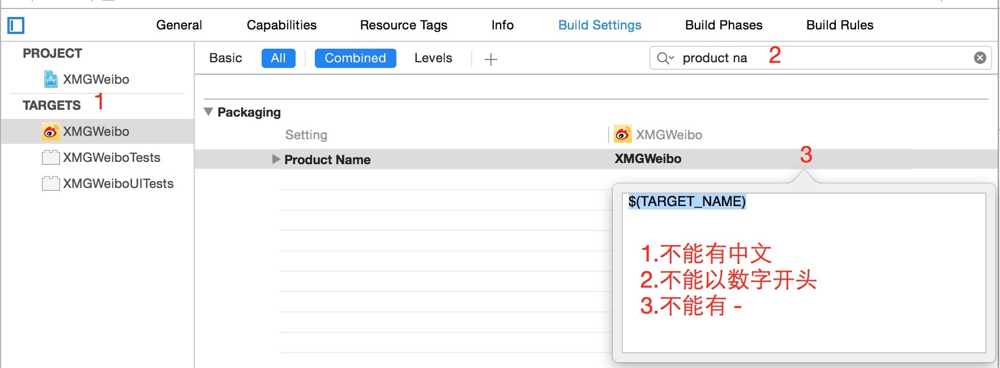

# 添加子控制器
---
```objc
Update更新：2016年5月26日 By {MISSAJJ琴瑟静听} 
```
## 功能需求

* 由于采用了多视图控制器的设计方式，因此需要通过代码的方式向主控制器中添加子控制器

## 文件准备

* 将素材文件夹中的 `TabBar` 拖拽到 `Images.xcassets` 目录下

## 代码实现

### 添加第一个视图控制器

```swift
override func viewDidLoad() {
    super.viewDidLoad()

    addChildViewController()
}

///  添加子控制器
private func addChildViewController() {

  // iOS7以后只需要设置tintColor, 那么图片和文字都会按照tintColor渲染
    tabBar.tintColor = UIColor.orangeColor()
    // 注意: Swift开发中定义变量时候先用let(常量), 只有真正需要修改时才用var
    let vc = HomeTableViewController()
    vc.title = "首页"
    vc.tabBarItem.image = UIImage(named: "tabbar_home")
    vc.tabBarItem.selectedImage = UIImage(named: "tabbar_home_highlighted")
    let nav = UINavigationController(rootViewController: vc)

    addChildViewController(nav)
}
```

### 修改图片的渲染模式

  - 代码方式

```Swift 
//取消图片被系统自动渲染,设置原始状态代码UIImage.init(named: imageName)?.imageWithRenderingMode(.AlwaysOriginal)
 
childController.tabBarItem.image = UIImage.init(named: imageName)?.imageWithRenderingMode(.AlwaysOriginal)
 
childController.tabBarItem.selectedImage = UIImage.init(named: imageName + "_highlighted")?.imageWithRenderingMode(.AlwaysOriginal)


```
  - Swift缩写方式


```Swift

//完整写法
var image : UIImage? = UIImage(named:"myImage.png").imageWithRenderingMode(UIImageRenderingMode.AlwaysOriginal)

//缩写方式
var image : UIImage? = UIImage(named:"myImage.png").imageWithRenderingMode(.AlwaysOriginal)
```
  - Assets.xcassets 设置方式




###创建多个子控制器的完整代码
```Swift
//
//  MainViewController.swift
//  MASINAWEIBO
//
//  Created by MISSAJJ on 16/5/26.
//  Copyright © 2016年 MISSAJJ. All rights reserved.
//

import UIKit

class MainViewController: UITabBarController {

    override func viewDidLoad() {
        super.viewDidLoad()

        // iOS7以后只需要设置tintColor, 那么图片和文字都会按照tintColor渲染 : 如果使用了使用原始图片,那就不需要设置 tintcolor
        //tabBar.tintColor = UIColor.orangeColor()
        
        //添加所有子控制器
        addChildViewControllers()
    }
    
    //MARK: - 添加所有子控制器
    func addChildViewControllers()
    {
     
         addChildViewController(HomeTableViewController(), title: "首页", imageName: "tabbar_home")
         addChildViewController(MessageTableViewController(), title: "消息", imageName: "tabbar_message_center")
         addChildViewController(DiscoverTableViewController(), title: "发现", imageName: "tabbar_discover")
         addChildViewController(ProfileTableViewController(), title: "我", imageName: "tabbar_profile")
       
    }
    
    //MARK: - 添加一个子控制器
   func addChildViewController(childController: UIViewController, title: String, imageName: String) {
    
    
        //添加子控制器
 //取消图片被系统自动渲染,设置原始状态代码UIImage.init(named: imageName)?.imageWithRenderingMode(.AlwaysOriginal)
 
//childController.tabBarItem.image = UIImage.init(named: imageName)
 childController.tabBarItem.image = UIImage.init(named: imageName)?.imageWithRenderingMode(.AlwaysOriginal)
 childController.tabBarItem.selectedImage = UIImage.init(named: imageName + "_highlighted")?.imageWithRenderingMode(.AlwaysOriginal)
    
        //设置自控制器的导航栏标题
        childController.title = title
    
        //包装导航控制器
        let nav = UINavigationController.init(rootViewController: childController)
    
        //将子控制器添加到UITabBarController中
        addChildViewController(nav)

        
        
    }
}

```

###项目模拟器截图




#其他知识补充:命名空间
---
### 用代码动态创建类

* 跟踪 `类` 名称

```swift
print(vc)
```

* 小结
    * 在 swift 中，类名的组成格式是 `namespace.类名`
    * namespace 对应的是 `CFBundleExecutable`

* 从 `mainBundle` 的 `infoDictionary` 获取命名空间名称

```swift
print(NSBundle.mainBundle().infoDictionary)

let namespace = NSBundle.mainBundle().infoDictionary!["CFBundleExecutable"] as! String
```

* Tips
    + 在 swift 中，类名是包含命名空间的
    + 命名空间默认是项目名称，同一个命名空间全局共享
    + 如果新建项目时，项目名称中包含有中文，可以按照下图修改
    + 


* 调整创建控制器代码，根据类名动态创建类

```swift
let namespace = NSBundle.mainBundle().infoDictionary!["CFBundleExecutable"] as! String
let clsName = namespace + "." + vcName
let cls: AnyClass = NSClassFromString(clsName)!
let vc = cls.alloc() as! UITableViewController
```

* 扩展方法参数，增加`标题`和`图像名`参数

```swift
///  添加子控制器
///
///  :param: vcName    视图控制器名称
///  :param: title     标题
///  :param: imageName 图像名
private func addChildViewController(vcName: String, title: String, imageName: String) {
    tabBar.tintColor = UIColor.orangeColor()

    let namespace = NSBundle.mainBundle().infoDictionary!["CFBundleExecutable"] as! String
    let clsName = namespace + "." + vcName
    // 告诉编译器暂时就是AnyClass
    let cls: AnyClass!  = NSClassFromString(ns + "." + vcName)
    // 告诉编译器真实类型是UIViewController
    let vcCls = cls as! UIViewController.Type
    // 实例化控制器
    let vc = vcCls.init()


    vc.title = title
    vc.tabBarItem.image = UIImage(named: imageName)
    vc.tabBarItem.selectedImage = UIImage(named: imageName + "_highlighted")
    let nav = UINavigationController(rootViewController: vc)

    addChildViewController(nav)
}
```

* 扩充调用函数，添加其他控制器

```swift
///  添加所有子控制器
private func addChildViewControllers() {
    addChildViewController("HomeTableViewController", title: "首页", imageName: "tabbar_home")
    addChildViewController("MessageTableViewController", title: "消息", imageName: "tabbar_message_center")
    addChildViewController("DiscoverTableViewController", title: "发现", imageName: "tabbar_discover")
    addChildViewController("ProfileTableViewController", title: "我", imageName: "tabbar_profile")
}
```

