# 项目Git部署


```objc
Update更新：2016年5月25日 By {MISSAJJ琴瑟静听}
 
```
``` 
关于项目 git 部署这个章节,写了很长时间,
对于 git 的操作截了很多步骤图和操作图,
是因为我在如何显示系统隐藏文件上走了很多弯路,
所以特地整理了截图帮助新手们解决问题.
``` 


###开源中国社区官方网站 https://git.oschina.net/

* 开源中国社区成立于2008年8月，其目的是为中国的IT技术人员提供一个全面的、快捷更新的用来检索开源软件以及交流使用开源经验的平台
* 目前国内有很多公司会将公司的项目部署在 `OSChina`

### 与 `GitHUB` 的对比

1. 服务器在国内，速度更快
2. 免费账户同样可以建立 `私有` 项目，而 `GitHUB` 上要建立私有项目必须 `付费`

### 使用开源中国Git

* 注册账号 [如何注册就不演示了]
    * 建议不要使用新浪邮箱，使用新浪邮箱可能会收不到验证邮件

* 添加 SSH 公钥，进入终端，并输入以下命令

    * 开源中国帮助文档地址：https://git.oschina.net/oschina/git-osc/wikis/帮助#ssh-keys

* 进入.ssh目录
```bash
# 切换目录，MAC中目录的第一个字符如果是 `.` 表示改文件夹是隐藏文件夹
$ cd ~/.ssh
#如果.ssh文件夹不存在，可以执行指令自行创建
$ mkdir ~/.ssh
# 查看当前目录文件
$ ls 
```
* 终端显示
 

 
 
 
* 生成 RSA 密钥对
```bash
$ ssh-keygen -t rsa -C "你的邮箱@xxx.com"
# 为了方便，全程回车即可（不用了输入ras文件名及密码）
```

* 查看公钥内容
```bash
$ cat ~/.ssh/id_rsa.pub
```
 

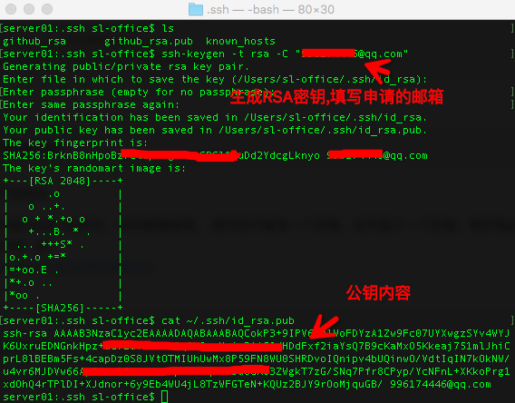

* 将公钥内容复制并粘贴至
    + 注意：公钥内容以ssh-rsa开头，你的邮箱结尾， 拷贝时不能多一个空格，也不能少一个空格，格式等必须和生成的公钥一致
    + https://git.oschina.net/profile/sshkeys

 

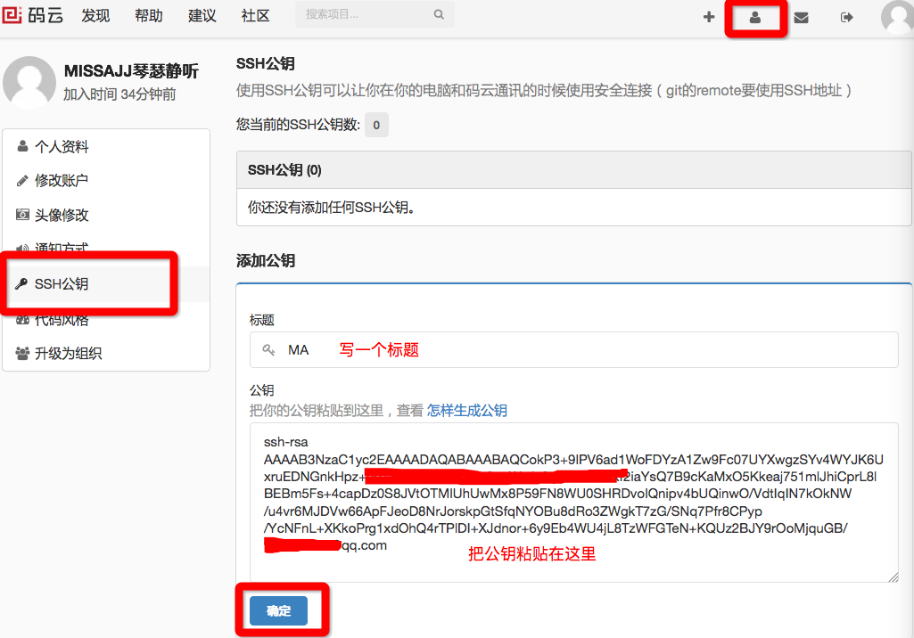


 * 测试公钥

```bash
# 测试 SSH 连接
$ ssh -T git@git.oschina.net

# 终端提示 Welcome to Git@OSC, MISSAJJ琴瑟静听! 说明连接成功
```
 

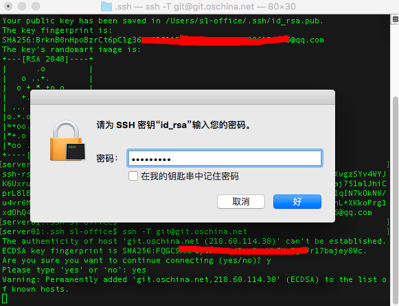

* 测试成功


---
* 在oschina新建项目

 

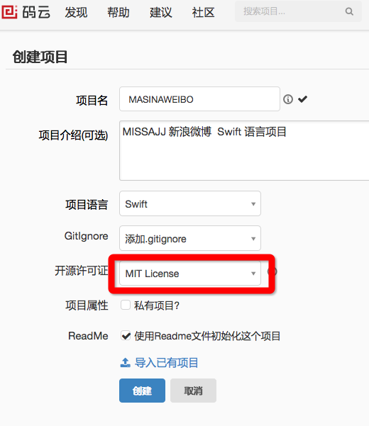
* 克隆项目

配置好sshkey之后， 以后只需要拷贝ssh链接地址，然后利用git指令即可进行相关操作


- 拷贝SSH链接地址
 


```bash
$ git clone git@git.oschina.net:xxx/ProjectName.git
```
 

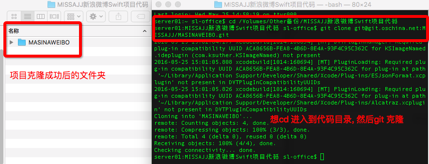


*  注意：oschina仓库对应多种地址，一个是通过http访问的地址，一个是通过ssh访问的地址
    + http方式：https://git.oschina.net/MISSAJJ/MASINAWEIBO.git
    + ssh方式：git@git.oschina.net:MISSAJJ/MASINAWEIBO.git


* 终端拷贝 `gitignore`的例句 
```bash
#/Users/NJ-Lee/Desktop/gitignore-master/ 是保存 gitignore 的目录
# $ cp /Users/NJ-Lee/Desktop/gitignore-master/Swift.gitignore .gitignore
server01:~ sl-office$ cp /Volumes/Other备份/MISSAJJ新浪微博Swift项目代码/gitignore-master/Swift.gitignore /Volumes/Other备份/MISSAJJ新浪微博Swift项目代码/MASINAWEIBO/.gitignore
```

* 拷贝后添加 `gitignore`  
```bash
$ git add .
$ git commit -m"添加gitignore"
$ git push
```
- 添加gitignore成功 


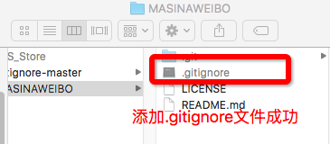

- 提交文件

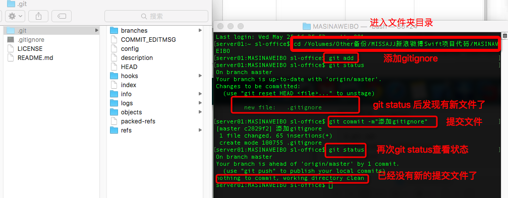


- push更新项目

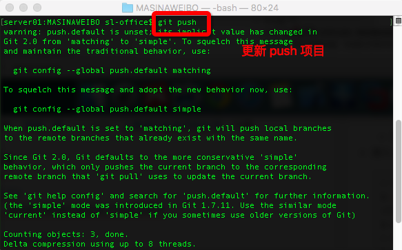

- 检查开源中国平台是否push成功

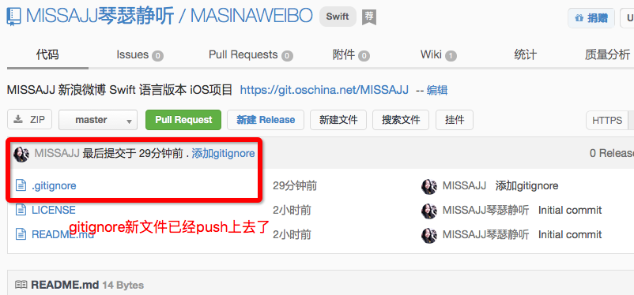

* 提示：
    * 可以从 `https://github.com/github/gitignore` 获取最新版本的 `gitignore` 文件
    * 添加 `.gitignore` 文件之后，每次提交时不会将个人的项目设置信息（例如：末次打开的文件，调试断点等）提交到服务器，在团队开发中非常重要


### [重要:]如果看不到隐藏文件.gitignore怎么办?
 


```bash
打开终端，输入：
defaults write com.apple.finder AppleShowAllFiles -bool true 此命令显示隐藏文件
defaults write com.apple.finder AppleShowAllFiles -bool false 此命令关闭显示隐藏文件
```


 + 命令运行之后需要重新加载Finder：快捷键option+command+esc，选中Finder，重新启动即可 


- 搞定,可以看到隐藏文件了

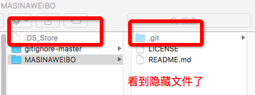

###在Xcode创建创建和Git克隆下来的项目同步的Swift项目

- Xcode创建项目


- 选择 Git克隆下来的项目文件夹


- 项目创建成功

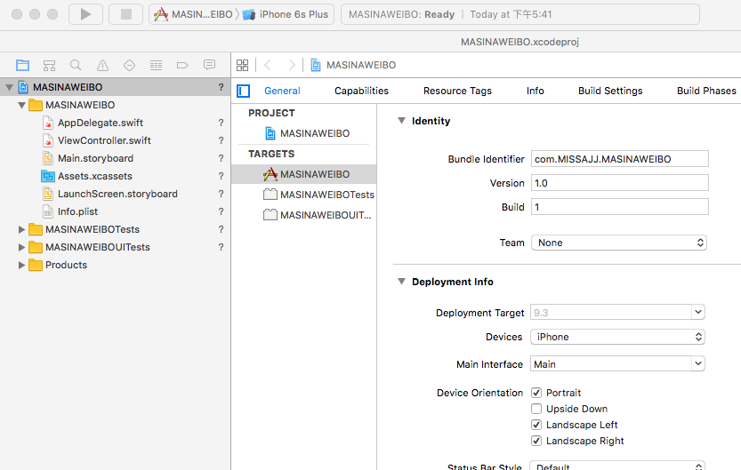