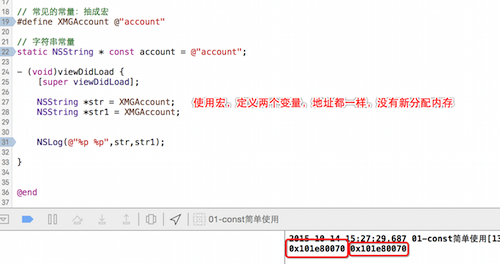

# const，static，extern简介、作用和使用

 
---
```objc
Update更新：2016年5月20日 By {MISSAJJ琴瑟静听}
```
### 一、const与宏的区别（面试题）:
* `const简介`:之前常用的字符串常量，一般是抽成宏，但是苹果不推荐我们抽成宏，推荐我们使用const常量。
	* `执行时刻`:宏是预编译（编译之前处理），const是编译阶段。
	* `编译检查`:宏不做检查，不会报编译错误，只是替换，const会编译检查，会报编译错误。
	* `宏的好处`:宏能定义一些函数，方法。 const不能。
	* `宏的坏处`:使用大量宏，容易造成编译时间久，每次都需要重新替换。
	
	注意:很多Blog都说使用宏，会消耗很多内存，我这验证并不会生成很多内存，宏定义的是常量，常量都放在常量区，只会生成一份内存。
	
	
	


```objc
// 常见的常量：抽成宏
#define XMGAccount @"account"

#define XMGUserDefault [NSUserDefaults standardUserDefaults]

// 字符串常量
static NSString * const account = @"account";

- (void)viewDidLoad {
    [super viewDidLoad];
    
    // 偏好设置存储
    // 使用宏
    [XMGUserDefault setValue:@"123" forKey:XMGAccount];
    
    // 使用const常量
    [[NSUserDefaults standardUserDefaults] setValue:@"123" forKey:account];
    
}

```
	
### 二、const作用：限制类型
	*	1.const仅仅用来修饰右边的变量（基本数据变量p，指针变量*p）
	*	2.被const修饰的变量是只读的。

*  `const基本使用`

```objc
- (void)viewDidLoad {
    [super viewDidLoad];
    
    // 定义变量
    int a = 1;
    
    // 允许修改值
    a = 20;
    
    // const两种用法
    // const:修饰基本变量p
    // 这两种写法是一样的，const只修饰右边的基本变量b
    const int b = 20; // b:只读变量
    int const b = 20; // b:只读变量
    
    // 不允许修改值
    b = 1;
    
    // const:修饰指针变量*p，带*的变量，就是指针变量.
    // 定义一个指向int类型的指针变量，指向a的地址
    int *p = &a;
    
    int c = 10;
    
    p = &c;
    
    // 允许修改p指向的地址，
    // 允许修改p访问内存空间的值
    *p = 20;
    
    // const修饰指针变量访问的内存空间，修饰的是右边*p1，
    // 两种方式一样
    const int *p1; // *p1：常量 p1:变量
    int const *p1; // *p1：常量 p1:变量
    
    // const修饰指针变量p1
    int * const p1; // *p1:变量 p1:常量

    
    // 第一个const修饰*p1 第二个const修饰 p1
    // 两种方式一样
    const int * const p1; // *p1：常量 p1：常量
    
    int const * const p1;  // *p1：常量 p1：常量
    
    
    
}

```


### 三、const开发中使用场景:
	*	1.需求1:提供一个方法，这个方法的参数是地址，里面只能通过地址读取值,不能通过地址修改值
	*	2.需求2:提供一个方法，这个方法的参数是地址，里面不能修改参数的地址。

```objc
@implementation ViewController

// const放*前面约束参数，表示*a只读
// 只能修改地址a,不能通过a修改访问的内存空间
- (void)test:(const int * )a
{
//    *a = 20;
}

// const放*后面约束参数，表示a只读
// 不能修改a的地址，只能修改a访问的值
- (void)test1:(int * const)a
{
    int b;
    // 会报错
    a = &b;
    
    *a = 2;
}

- (void)viewDidLoad {
    [super viewDidLoad];
    // Do any additional setup after loading the view, typically from a nib.
    
    int a = 10;
    
    // 需求1:提供一个方法，这个方法的参数是地址，里面只能通过地址读取值,不能通过地址修改值。
    
    // 这时候就需要使用const，约束方法的参数只读.
    [self test:&a];
    
    // 需求2:提供一个方法，这个方法的参数是地址，里面不能修改参数的地址。
    [self test1:&a];
}


@end
```

### 四、static和extern简单使用(要使用一个东西，先了解其作用)

*	`static作用`:
 	* 修饰局部变量：
 	
 		1.延长局部变量的生命周期,程序结束才会销毁。
 		
		2.局部变量只会生成一份内存,只会初始化一次。
		 
		3.改变局部变量的作用域。
 
	 * 修饰全局变量
	 
 		1.只能在本文件中访问,修改全局变量的作用域,生命周期不会改
 
		2.避免重复定义全局变量
 
 
 * 	`extern作用`:
 	*	只是用来获取全局变量(包括全局静态变量)的值，不能用于定义变量
 *	`extern工作原理`:
 	* 	先在当前文件查找有没有全局变量，没有找到，才会去其他文件查找。
 	
```objc
// 全局变量：只有一份内存，所有文件共享，与extern联合使用。
int a = 20;

// static修饰全局变量
static int age = 20;

- (void)test
{
    // static修饰局部变量
    static int age = 0;
    age++;
    NSLog(@"%d",age);
}

- (void)viewDidLoad {
    [super viewDidLoad];
    // Do any additional setup after loading the view, typically from a nib.
    
    
    [self test];
    [self test];
    
    extern int age;
    NSLog(@"%d",age);
}
I
```

### 五、static与const联合使用
*	static与const作用:声明一个只读的静态变量
*	开发使用场景:在`一个文件中`经常使用的字符串常量，可以使用static与const组合

```objc
// 开发中常用static修饰全局变量,只改变作用域

// 为什么要改变全局变量作用域，防止重复声明全局变量。

// 开发中声明的全局变量，有些不希望外界改动，只允许读取。

// 比如一个基本数据类型不希望别人改动

// 声明一个静态的全局只读常量
static const int a = 20;

// staic和const联合的作用:声明一个静态的全局只读常量

// iOS中staic和const常用使用场景，是用来代替宏，把一个经常使用的字符串常量，定义成静态全局只读变量.

// 开发中经常拿到key修改值，因此用const修饰key,表示key只读，不允许修改。
static  NSString * const key = @"name";

// 如果 const修饰 *key1,表示*key1只读，key1还是能改变。

static  NSString const *key1 = @"name";

```


### 六、extern与const联合使用
*	开发中使用场景:在`多个文件中`经常使用的同一个字符串常量，可以使用extern与const组合。
*	原因:
	*	static与const组合：在每个文件都需要定义一份静态全局变量。
	*	extern与const组合:只需要定义一份全局变量，多个文件共享。
*  全局常量正规写法:开发中便于管理所有的全局变量，通常搞一个GlobeConst文件，里面专门定义全局变量，统一管理，要不然项目文件多不好找。


* GlobeConst.h

```objc
/*******************************首页****************************/

extern NSString * const nameKey = @"name";

/*******************************首页****************************/
```

* GlobeConst.m

```objc
#import <Foundation/Foundation.h>

/*******************************首页****************************/

NSString * const nameKey = @"name";


/*******************************首页****************************/

``` 