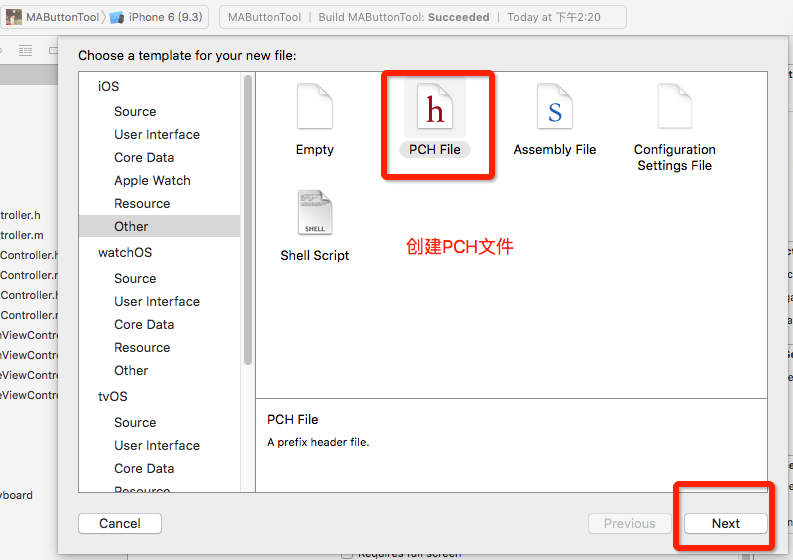
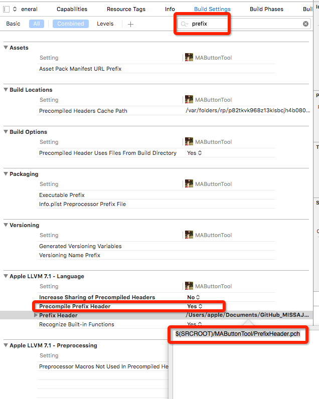
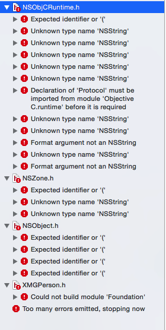
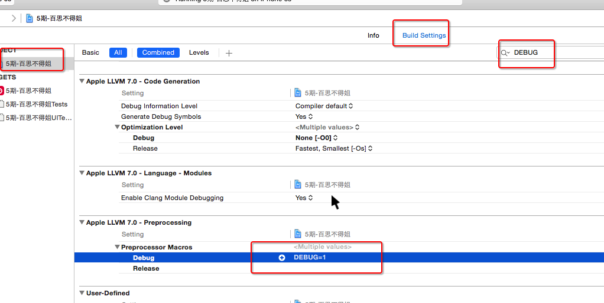
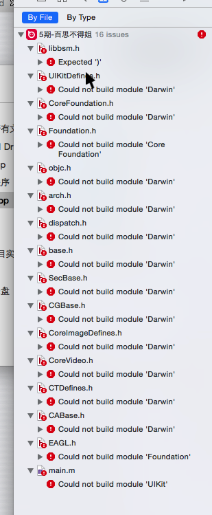

# PCH文件的设置创建

 
---
```objc
Update更新：2016年5月9日 By {MISSAJJ琴瑟静听}
```

##什么是PCH文件？
PCH文件是预编译头文件(一般扩展名为.PCH)，是把一个工程中较稳定的代码预先编译好放在一个文件(.PCH)里。这些预先编译好的代码可以是任何的C/C++代码--甚至可以是inline函数,一般是整个工程中是较为稳定的,不会经常被修改的代码，可以用来存储共享信息，比如设备屏幕的宽度，高度，版本号等公用信息

Xcode老版本会自动为我们创建PCH文件，但自Xcode6之后创建项目的时候不会自动创建了，所以需要自己手动创建

##PCH文件的创建

1、如图添加一个PCH新文件，在IOS-》Other目录



2、设置PCH文件目录

- 1、Build Setttings搜索prefix
- 2、Precompile Prefix Header 选择为YES
- 3、设置Prefix Header目录为 $(SRCROOT)/项目文件夹/PrefixHeader.pch

 如：$(SRCROOT)/MAButtonTool/PrefixHeader.pch


## PCH文件可能引发的错误

- 解决方案

```objc
#ifndef PrefixHeader_pch
#define PrefixHeader_pch

/*** 如果希望某些内容能拷贝到任何源代码文件(OC\C\C++等), 那么就不要写在#ifdef __OBJC__和#endif之间 ***/


/***** 在#ifdef __OBJC__和#endif之间的内容, 只会拷贝到OC源代码文件中, 不会拷贝到其他语言的源代码文件中 *****/
#ifdef __OBJC__


#endif
/***** 在#ifdef __OBJC__和#endif之间的内容, 只会拷贝到OC源代码文件中, 不会拷贝到其他语言的源代码文件中 *****/


#endif
```

## 在Build Setting中配置宏
- 如果项目中有些宏找不到, 可能是配置在Build Setting中


- 注意点:宏的名字不能全部是小写字母

- 如果宏的名字全部是小写, 会出现以下错误

## 常用PCH文件内的宏定义

请参考这份MISSAJJ整理的PCH文件
```objc
//
//  PrefixHeader.pch
//  museum
//
//  Created by MISSAJJ on 15/5/5.
//  Copyright (c) 2015年 MISSAJJ. All rights reserved.
//
#import <Availability.h>
#ifndef museum_PrefixHeader_pch
#define museum_PrefixHeader_pch

// Include any system framework and library headers here that should be included in all compilation units.
// You will also need to set the Prefix Header build setting of one or more of your targets to reference this file.
#ifndef __IPHONE_5_0
#warning "This project uses features only available in iOS SDK 5.0 and later."
#endif

#ifndef __IPHONE_3_0
#warning "This project uses features only available in iOS SDK 3.0 and later."
#endif


#ifdef __OBJC__
//导入全局宏扩展-自定义tabbar
#import <UIKit/UIKit.h>
#import <Foundation/Foundation.h>
#import <QuartzCore/QuartzCore.h>
#import "AppDelegate.h"
#import <sqlite3.h>


//Custom tools
//#import "MAToolsHeader.h" //MISSAJJ工具集


#endif


/**
 *  @author MISSAJJ, 15-11-25 13:11:22
 *   在release版本禁止输出NSLog内容
 *   
 代码意思：用宏指令做一个判断，如果DEBUG为真，则编译#ifdef到#endif宏定义，否则编译器就不编译
 NSLog的输出还是比较消耗系统资源的，而且输出的数据也可能会暴露出App里的保密数据，所以发布正式版时需要把这些输出全部屏蔽掉。
 
优雅的解决方法，就是在项目的prefix.pch文件里加入下面一段代码，加入后，NSLog就只在Debug下有输出，Release下不输出了。
 
 
 在 "Target > Build Settings > Preprocessor Macros > Debug" 里有一个"DEBUG=1"。
 设置为Debug模式下，Product-->Scheme-->SchemeEdit Scheme
 设置Build Configuration成Debug时，就可以打印nslog了。
 设置Release，无打印
 设置Archive为Release,这样发布app版本的时候就不会打印了，提高了性能
 */

/*** 日志 ***/
#ifdef DEBUG
#define NSLog(...) NSLog(__VA_ARGS__)
#define debugMethod() NSLog(@"%s", __func__)
#else
#define NSLog(...)
#define debugMethod()
#endif

 
#define NSLogFunc NSLog(@"%s",__func__);


///*
// *比例  按照iphone5的比例，iphone4单独做xib适配比例为1.0
//  本方法iPad不适用，只适用于4，5，6，6Plus。
//  本方法用在iPhone上的话只需准备4，5的尺寸两套布局。效率高，也方便后期维护。
//  5，6，6Plus三种屏幕的尺寸宽高比是差不多的，因此可以在5的基础上，按比例放大来兼容6和6Plus的屏幕
// http://blog.it985.com/5121.html
// */ 
#define  autoSizeScaleX   kDeviceWidth/320
#define  autoSizeScaleY   kDeviceHeight/568


/**
 *  统一设置空置的默认图片
 *
 */
//背景图片
#define EMPTY_IMAGE [UIImage imageNamed:@"greyBackground"]
//拉伸背景
#define EMPTY_RESIZED_IMAGE  [UIImage resizedImage:@"greyBackground"]

//api更新时间
#define MERCHANT_MIN_DURATION 60 * 60 * 2 //2 hours
#define NEWS_MIN_DURATION 60 * 0.5 //5 minutes
#define STORY_MIN_DURATION 60 * 60 * 2 //游记缓存时间 2 hours


#define SEGMENTHEIGHT  50
#define NAVHEIGHT      64
#define TABBARHEIGHT   49

//标题字体大小
#define  TITLEFONTSIZE 16

//RGB Color macro
#define UIColorFromRGB(rgbValue) [UIColor \
colorWithRed:((float)((rgbValue & 0xFF0000) >> 16))/255.0 \
green:((float)((rgbValue & 0xFF00) >> 8))/255.0 \
blue:((float)(rgbValue & 0xFF))/255.0 alpha:1.0]

//RGB color macro with alpha
#define UIColorFromRGBWithAlpha(rgbValue,a) [UIColor \
colorWithRed:((float)((rgbValue & 0xFF0000) >> 16))/255.0 \
green:((float)((rgbValue & 0xFF00) >> 8))/255.0 \
blue:((float)(rgbValue & 0xFF))/255.0 alpha:a]

//不换行，release下会报错，所以用上边的红定义
//#define UIColorFromRGB(rgbValue) [UIColor colorWithRed:((float)((rgbValue & 0xFF0000) >> 16))/255.0 green:((float)((rgbValue & 0xFF00) >> 8))/255.0 blue:((float)(rgbValue & 0xFF))/255.0 alpha:1.0]

#define kThemeDidChangeNotification @"kThemeDidChangeNotification"


//定义屏幕宽度和高度的宏, 做适配
#define kDeviceHeight [UIScreen mainScreen].bounds.size.height
#define kDeviceWidth  [UIScreen mainScreen].bounds.size.width

//是否是iphone5
#define iPhone5 ([UIScreen instancesRespondToSelector:@selector(currentMode)] ? [[UIScreen mainScreen] currentMode].size.height>960 : NO)

#define isIPhone5 ([UIScreen instancesRespondToSelector:@selector(currentMode)] ? [[UIScreen mainScreen] currentMode].size.height==1136 : NO)
#define isIPhone6 ([UIScreen instancesRespondToSelector:@selector(currentMode)] ? [[UIScreen mainScreen] currentMode].size.height==1334 : NO)
#define isIPhone6Plus ([UIScreen instancesRespondToSelector:@selector(currentMode)] ? [[UIScreen mainScreen] currentMode].size.height==2208 : NO)

#define isRetina ([UIScreen mainScreen].scale>1.0)
//判断系统是否是iOS7
#define IOS7 ([[[UIDevice currentDevice] systemVersion] floatValue] >= 7.0 ? YES : NO)
#define IOS8 ([[[UIDevice currentDevice] systemVersion] floatValue] >= 8.0 ? YES : NO)

//版本号
#define VERSION  [[[NSBundle mainBundle] infoDictionary] valueForKey:@"CFBundleShortVersionString"]
//build号
#define BUILD   [[[NSBundle mainBundle] infoDictionary] objectForKey:@"CFBundleVersion"]

#define DEVICE_IOS  @"ios"

//常规适配 navi, 底部tabbar 高度
#define NAVHEIGHT      64
#define TABBARHEIGHT_IPAD   79
#define TABBARHEIGHT   49


#define HTTPMETHOD_POST       @"POST"
#define HTTPMETHOD_GET        @"GET"


//全局主题色
//#define themeColor @"8000FF"  //紫色
//#define themeColor @"1E90FF"
#define themeColor @"fad93b"

#define IOS   [[[UIDevice currentDevice] systemVersion] floatValue]  //在8.0 以上系统判定不靠谱，获得为8.100000，而不是8.1，为IOS SDK 的bug

//设备IOS版本号
#define IOSVERSION  [[UIDevice currentDevice] systemVersion]

#define IPHONE  [[UIDevice currentDevice] userInterfaceIdiom] == UIUserInterfaceIdiomPhone


//获得RGB颜色
#define RGBA(r, g, b, a)                    [UIColor colorWithRed:r/255.0f green:g/255.0f blue:b/255.0f alpha:a]
#define RGB(r, g, b)                        RGBA(r, g, b, 1.0f)

#define navigationBarColor RGB(33, 192, 174)
#define separaterColor RGB(200, 199, 204)


//是否为4inch
#define fourInch ([UIScreen mainScreen].bounds.size.height == 568)

//屏幕大小尺寸
#define MAWidth [UIScreen mainScreen].bounds.size.width
#define MAHeight [UIScreen mainScreen].bounds.size.height

//重新设定view的Y值
#define setFrameY(view, newY) view.frame = CGRectMake(view.frame.origin.x, newY, view.frame.size.width, view.frame.size.height)
#define setFrameX(view, newX) view.frame = CGRectMake(newX, view.frame.origin.y, view.frame.size.width, view.frame.size.height)
#define setFrameH(view, newH) view.frame = CGRectMake(view.frame.origin.x, view.frame.origin.y, view.frame.size.width, newH)


//取view的坐标及长宽
#define W(view)    view.frame.size.width
#define H(view)    view.frame.size.height
#define X(view)    view.frame.origin.x
#define Y(view)    view.frame.origin.y

//常用对象 加括号()括起来
#define APPDELEGATE ((AppDelegate *)[UIApplication sharedApplication].delegate)

//常用对象window
#define MAKeyWindow [UIApplication sharedApplication].keyWindow
//经纬度
//#define LATITUDE_DEFAULT 39.983497
//#define LONGITUDE_DEFAULT 116.318042

//weakSelf
#define WeakSelf __weak typeof(self) weakSelf = self;


#define FONT_TITLE_SIZE 17.0
#define FONT_CAPTION [UIFont boldSystemFontOfSize:15.0]

#define EscapeString(value) \
[value stringByReplacingOccurrencesOfString:@"'" withString:@"''"]

#define GetLocalizedString(key, comment) \
[[LocalizationManager sharedLocalizationManager] localizedStringForKey:(key) value:(comment)]

#define LocalizationSetLanguage(language) \
[[LocalizationManager sharedLocalizationManager] setLanguage:(language)]

#define LocalizationGetLanguage \
[[LocalizationManager sharedLocalizationManager] getLanguage]

#define LocalizationReset \
[[LocalizationManager sharedLocalizationManager] resetLocalization]


#endif

```

