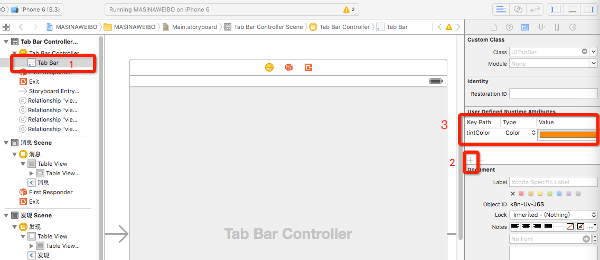
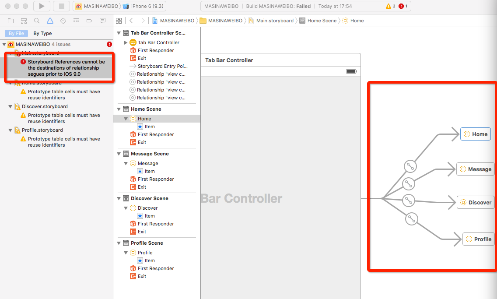

# storyboard快速创建项目框架
---
```objc
Update更新：2016年5月30日 By {MISSAJJ琴瑟静听} 
```

如何用 storyboard创建项目是基本功,所以太初级的内容不多写了, 在此写几个有用的功能

###如何通过storyboard添加tintColor
```
1.设置 Tabbar 的 tintColor, 要点击 tabbar再设置
2.keyPath 为 tintColor,type 选择 Color, 然后选择颜色即可
```
 
 
 ###Storyboard Reference仅支持 iOS9.0
 
早期 storyboard 对于团队开发很不友好,所以一般很少用 storyboard, 在 IOS9.0 之后有了 Storyboard Reference 功能, 可以将不同的界面独立分开给团队人员,下面简单讲一下如何设置


-  创建Refactor to Storyboard


-  保存故事版文件


- Refactor to Storyboard 仅支持 iOS9.0



- 修改支持 IOS9.0


###Storyboard 跳转 和 传值    

在 iOS9.0之前也是可以分开创建 storyboard, 但是只能手动创建 storyboard 文件,再通过代码加载


- 调用 prepareForSegue 方法

```Swift 
//因为这里是 父视图 -> 子视图 传值, 所以要用 destinationViewController)
//注: 这里 Swift 的 自动补全可能失效, 所以 如果没有出现 destinationViewController, 没关系往后打.)
 
    override func prepareForSegue(segue: UIStoryboardSegue, sender: AnyObject?) {
        var theSegue = segue.destinationViewController as SecondViewController
        theSegue.text = "MISSAJJ"
    }
```

- 利用 self.storyboard

```Swift 
利用 self.storyboard 方法, 就不需要进行连线, 
一样可以进行视图之间的跳转. 但是必须要设置 Storyboard ID.

然后利用 如下方法进行 跳转 和 传值
    var thirdVC = self.storyboard?.instantiateViewControllerWithIdentifier("ThirdViewController") as ThirdViewController
    thirdVC.text = "Pass"
    self.navigationController?.pushViewController(thirdVC, animated: true)
```

- 利用 UIStoryboard

```Swift 
当需要做多个不同功能的模块,分离多个 sence 在不同的 Storyboard 里面,就要用 UIStoryboard
相对于 XIB 来说, 每个文件夹只需要 1 个 Storyboard 文件和 Swfit 文件就可以了.

    var storyboard = UIStoryboard(name: "New", bundle: nil)
    var newVC = storyboard.instantiateViewControllerWithIdentifier("NewViewController") as NewViewController
    newVC.text = "Pass"
    self.navigationController?.pushViewController(newVC, animated: true)
```