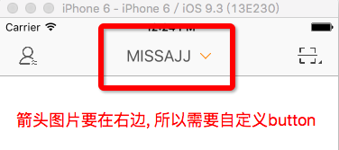
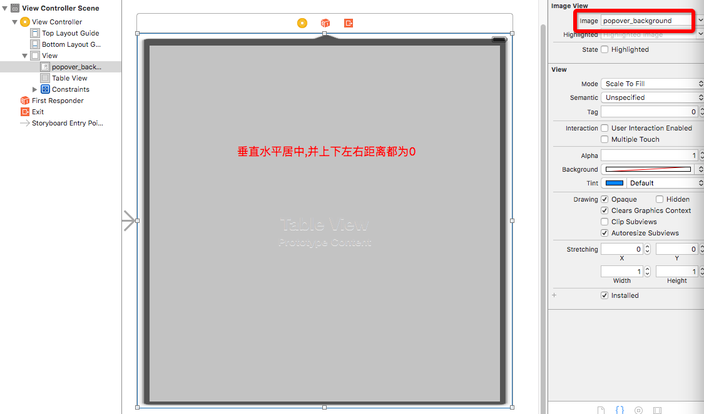

# 导航栏下拉菜单
---
```objc
Update更新：2016年6月2日 By {MISSAJJ琴瑟静听} 
```

##需求截图



##自定义button
- 创建继承与UIButton的分类TitleButton.swift

```Swift
 // MARK: - 内部控制方法
    private func setupNav()
    {  
        // 添加标题按钮
        let titleButton = TitleButton()
        titleButton.setTitle("MISSAJJ", forState: UIControlState.Normal)
        titleButton.addTarget(self, action: Selector("titleBtnClick:"), forControlEvents: UIControlEvents.TouchUpInside)
        navigationItem.titleView = titleButton
    }
     
    @objc private func titleBtnClick(btn: TitleButton)
    {
        btn.selected = !btn.selected
    }
```
- 重写UIButton的集中不同方式

  - 1.重写RectForContentRect,将按钮的文字标题和图片交换过来

```swift
    override func titleRectForContentRect(contentRect: CGRect) -> CGRect {
        return CGRectZero
    }
    override func imageRectForContentRect(contentRect: CGRect) -> CGRect {
        return CGRectZero
    }
```
  - 2.通过layoutSubviews重新布局

```swift
   override func layoutSubviews() {
        super.layoutSubviews()
        
        /*  
        // offsetInPlace 方法用于设置控件的偏移位
        //注意:layoutSubviews会被调用两次,所以用了非主流方法width * 0.5(一半)
        titleLabel?.frame.offsetInPlace(dx: -imageView!.frame.width * 0.5, dy: 0)
        imageView?.frame.offsetInPlace(dx: titleLabel!.frame.width * 0.5, dy: 0)
        */
        
        // 和OC不太一样, Swift语法允许我们直接修改一个对象的结构体属性的成员
        titleLabel?.frame.origin.x = 0 //标题X设置为0
        imageView?.frame.origin.x = titleLabel!.frame.width //图片的X为标题的宽
    }

```

##完整代码

```Swift
//  TitleButton.swift
//  MISSAJJ
//
//  Created by MISSAJJ on 16/6/2.
//  Copyright © 2016年 MISSAJJ. All rights reserved.
//

import UIKit

class TitleButton: UIButton {
    
    // 通过纯代码创建时调用
    // 在Swift中如果重写父类的方法, 必须在方法前面加上override
    override init(frame: CGRect) {
        super.init(frame: frame)
        
       setupUI()
    }

    // 通过XIB/SB创建时调用
    required init?(coder aDecoder: NSCoder) {
        // 系统对initWithCoder的默认实现是报一个致命错误
//        fatalError("init(coder:) has not been implemented")
        super.init(coder: aDecoder)
        
        setupUI()
    }
    
    private func setupUI()
    {
        setImage(UIImage(named: "navigationbar_arrow_down"), forState: UIControlState.Normal)
        setImage(UIImage(named: "navigationbar_arrow_up"), forState: UIControlState.Selected)
        
        setTitleColor(UIColor.darkGrayColor(), forState: UIControlState.Normal)
        sizeToFit()
    }
    
    override func setTitle(title: String?, forState state: UIControlState) {
        //此处title为?可选类型, 而加的"  "空格是不可选类型,不同的类型不能结合,所以用(title ?? "")的方法解决为可选类型
        //?? 用于判断前面的参数是否是nil, 如果是nil就返回??后面的数据, 如果不是nil那么??后面的语句不执行
        super.setTitle((title ?? "") + "  ", forState: state) //这里多加了空格字符串, 用于标题和箭头按钮之间的距离
    }
    
    override func layoutSubviews() {
        super.layoutSubviews()
        
        /*
        // offsetInPlace 方法用于设置控件的偏移位
        titleLabel?.frame.offsetInPlace(dx: -imageView!.frame.width * 0.5, dy: 0)
        imageView?.frame.offsetInPlace(dx: titleLabel!.frame.width * 0.5, dy: 0)
        */
        
        // 和OC不太一样, Swift语法允许我们直接修改一个对象的结构体属性的成员
        titleLabel?.frame.origin.x = 0
        imageView?.frame.origin.x = titleLabel!.frame.width
    }
}


```

##继续布局菜单


- 布局动画演示


- 创建Popover.storyboard

  - 布局Popover向上箭头背景视图
  

  - 布局Popover中Tableview控件
 


- 添加点击下拉菜单后的菜单栏
 


```Swift
 @objc private func titleBtnClick(btn: TitleButton)
    {
        // 1.修改按钮的状态
        btn.selected = !btn.selected
        
        // 2.显示菜单
        // 2.1创建菜单
        let sb = UIStoryboard(name: "Popover", bundle: nil)
        guard let menuView = sb.instantiateInitialViewController() else
        {
            return
        }
        // 自定义专场动画
        // 设置转场代理
        menuView.transitioningDelegate = self
        // 设置转场动画样式为 自定义Custom
        menuView.modalPresentationStyle = UIModalPresentationStyle.Custom
        
        // 2.2弹出菜单
        presentViewController(menuView, animated: true, completion: nil)
    }

//转场动画代理
extension HomeTableViewController: UIViewControllerTransitioningDelegate
{
    // 该方法用于返回一个负责转场动画的对象
    func presentationControllerForPresentedViewController(presented: UIViewController, presentingViewController presenting: UIViewController, sourceViewController source: UIViewController) -> UIPresentationController?
    {
        //新建继承与UIPresentationController的MAPresentationController类来重写转场方法
        return MAPresentationController(presentedViewController: presented, presentingViewController: presenting)
    }
}
```

- 添加点击下拉菜单后的菜单栏

```Swift

//  MAPresentationController.swift
//  XMGWB
//
//  Created by MISSAJJ on 16/6/2.
//  Copyright © 2016年 MISSAJJ. All rights reserved.
//

import UIKit

class XMGPresentationController: UIPresentationController {

    /*
    1.如果不自定义转场modal出来的控制器会移除原有的控制器
    2.如果自定义转场modal出来的控制器不会移除原有的控制器
    3.如果不自定义转场modal出来的控制器的尺寸和屏幕一样
    4.如果自定义转场modal出来的控制器的尺寸我们可以自己在containerViewWillLayoutSubviews方法中控制
    5.containerView 非常重要, 容器视图, 所有modal出来的视图都是添加到containerView上的
    6.presentedView() 非常重要, 通过该方法能够拿到弹出的视图
    */
    
    //override重写init方法
    override init(presentedViewController: UIViewController, presentingViewController: UIViewController) {
        super.init(presentedViewController: presentedViewController, presentingViewController: presentingViewController)
    }
    
    // 用于布局转场动画弹出的控件
    override func containerViewWillLayoutSubviews()
    {
        // 设置弹出视图的尺寸
        presentedView()?.frame = CGRect(x: 100, y: 45, width: 200, height: 200)
    }
}

```

