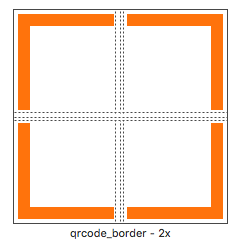

# 0.7.2.二维码冲击波动画

##搭建冲击波动画图
- 搭建效果图


- 拖一个Imageview作为边框图片qrcode_border


- 点Show Slicing切割拉升边框图片



- 在边框图上面再拖一个ImageView为冲击波图片qrcode_scanline_qrcode

- 将storyboard创建的控件拖线到QRCodeViewController.swift

```swift
    /// 底部工具条
    @IBOutlet weak var customTabbar: UITabBar!
    /// 冲击波视图
    @IBOutlet weak var scanLineView: UIImageView!
    /// 容器视图高度约束
    @IBOutlet weak var containerHeightCons: NSLayoutConstraint!
    /// 冲击波顶部约束
    @IBOutlet weak var scanLineCons: NSLayoutConstraint!
```

##根据选中的Tabbar按钮重新设置二维码容器高度

```swift
   // 2.添加监听代理, 监听底部工具条点击
        customTabbar.delegate = self
```

```swift
 extension QRCodeViewController: UITabBarDelegate
{
    func tabBar(tabBar: UITabBar, didSelectItem item: UITabBarItem) {
//        NJLog(item.tag)
        // 根据当前选中的按钮重新设置二维码容器高度
        containerHeightCons.constant = (item.tag == 1) ? 150 : 300
        view.layoutIfNeeded()
        
        // 移除动画
        scanLineView.layer.removeAllAnimations()
        
        // 重新开启动画
        startAnimation()
    }
}
```

##开启冲击波动画

```swift
// 开启冲击波动画
    private func startAnimation()
    {
        // 1.设置冲击波底部和容器视图顶部对齐
        scanLineCons.constant = -containerHeightCons.constant
        view.layoutIfNeeded()
        
        // 2.执行扫描动画
        // 在Swift中一般情况下不用写self, 也不推荐我们写self
        // 一般情况下只有需要区分两个变量, 或者在闭包中访问外界属性才需要加上self
        // 优点可以提醒程序员主动思考当前self会不会形成循环引用
        UIView.animateWithDuration(2.0) { () -> Void in
            UIView.setAnimationRepeatCount(MAXFLOAT)
            self.scanLineCons.constant = self.containerHeightCons.constant
            self.view.layoutIfNeeded()
        }

    }

```


##完整代码
```swift
//  QRCodeViewController.swift 

import UIKit

class QRCodeViewController: UIViewController {
    /// 底部工具条
    @IBOutlet weak var customTabbar: UITabBar!
    /// 冲击波视图
    @IBOutlet weak var scanLineView: UIImageView!
    /// 容器视图高度约束
    @IBOutlet weak var containerHeightCons: NSLayoutConstraint!
    /// 冲击波顶部约束
    @IBOutlet weak var scanLineCons: NSLayoutConstraint!
    
    override func viewDidLoad() {
        super.viewDidLoad()

        // 1.设置默认选中
        customTabbar.selectedItem = customTabbar.items?.first
        
        // 2.添加监听, 监听底部工具条点击
        customTabbar.delegate = self
    }
    
    override func viewDidAppear(animated: Bool) {
        super.viewDidAppear(animated)
        
        startAnimation()
    }

    /// 开启冲击波动画
    private func startAnimation()
    {
        // 1.设置冲击波底部和容器视图顶部对齐
        scanLineCons.constant = -containerHeightCons.constant
        view.layoutIfNeeded()
        
        // 2.执行扫描动画
        // 在Swift中一般情况下不用写self, 也不推荐我们写self
        // 一般情况下只有需要区分两个变量, 或者在闭包中访问外界属性才需要加上self
        // 优点可以提醒程序员主动思考当前self会不会形成循环引用
        UIView.animateWithDuration(2.0) { () -> Void in
            UIView.setAnimationRepeatCount(MAXFLOAT)
            self.scanLineCons.constant = self.containerHeightCons.constant
            self.view.layoutIfNeeded()
        }

    }
    
    @IBAction func photoBtnClick(sender: AnyObject) {
    }
    @IBAction func closeBtnClick(sender: AnyObject) {
        dismissViewControllerAnimated(true, completion: nil)
    }
}

extension QRCodeViewController: UITabBarDelegate
{
    func tabBar(tabBar: UITabBar, didSelectItem item: UITabBarItem) {
//        NJLog(item.tag)
        // 根据当前选中的按钮重新设置二维码容器高度
        containerHeightCons.constant = (item.tag == 1) ? 150 : 300
        view.layoutIfNeeded()
        
        // 移除动画
        scanLineView.layer.removeAllAnimations()
        
        // 重新开启动画
        startAnimation()
    }
}
```