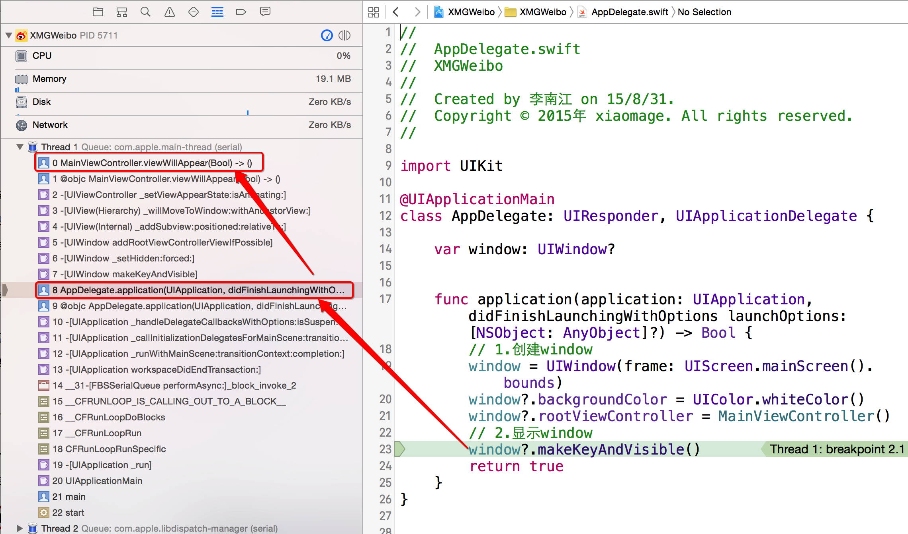

# 自定义 TabBar

## 功能需求

* 在 4 个控制器切换按钮中间增加一个撰写按钮
* 点击撰写按钮能够弹出对话框撰写微博

### 需求分析

* 添加占位控制器
* 计算控制器按钮位置，在中间添加一个 `撰写` 按钮

### 添加占位控制器

```swift
    /**
    添加所有子控制
    */
    private func addChildViewControllers()
    {
        addChildViewController(HomeTableViewController(), title: "首页", imageName: "tabbar_home")
        addChildViewController(MessageTableViewController(), title: "消息", imageName: "tabbar_message_center")
        // 添加一个占位的控制器
        addChildViewController(UIViewController())
        addChildViewController(DiscoverTableViewController(), title: "发现", imageName: "tabbar_discover")
        addChildViewController(ProfileTableViewController(), title: "我", imageName: "tabbar_profile")
    }
```

### 撰写按钮懒加载

```swift
/// 撰写按钮
    lazy private var composeButton:UIButton = {
        // 1.创建按钮
        let button = UIButton()
        // 2.设置图片
        button.setImage(UIImage(named: "tabbar_compose_icon_add"), forState: UIControlState.Normal)
        button.setImage(UIImage(named: "tabbar_compose_icon_add_highlighted"), forState: UIControlState.Highlighted)
        // 3.设置背景图片
        button.setBackgroundImage(UIImage(named: "tabbar_compose_button"), forState: UIControlState.Normal)
        button.setBackgroundImage(UIImage(named: "tabbar_compose_button_highlighted"), forState: UIControlState.Highlighted)
        // 5.添加到tabBar上
        // Swift中能不写self就不写self, 在闭包中必须写self
        self.tabBar.addSubview(button)
        // 6.返回按钮
        return button
    }()
```

* 先测试代码的可行性，再来细化 UI
* 懒加载的代码是一个闭包，因此在代码内部需要使用 `self.`

### 调整界面布局
* 在 `MainViewController` 中添加以下代码，并且增加断点

```swift
override func viewDidLoad() {
    super.viewDidLoad()

    addChildViewControllers()

    // The tab bar view associated with this controller. (read-only)
    print(tabBar)
    print(tabBar.items)
}

override func viewWillAppear(animated: Bool) {
    super.viewWillAppear(animated)

    print(__FUNCTION__)
    print(tabBar.items)
}
```

* 运行测试，通过调用堆栈观察可以发现

* viewDidLoad 方法调用是实例化控制器方法触发的


* 此时只是创建子控制器，而由于界面还没有显示，按照 iOS 开发的延迟创建原则，tabBar 中的 items 还没有被创建

* viewWillAppear 方法是由 `makeKeyAndVisible` 方法触发的


* 此时需要开始准备将控制器的子视图添加到界面上，因此 tabBar 中的 items 已经被创建

* 因此可以考虑在 viewWillAppear 方法中 计算加号按钮位置

### 计算 `撰写按钮` 的位置
```swift
    /**
    设置加号按钮位置
    */
    private func setupComposeButton()
    {
        // 1.计算按钮宽度
        let width = tabBar.bounds.width / CGFloat(viewControllers!.count)
        // 2.创建按钮frame
        let rect = CGRect(x: 0, y: 0, width: width, height: tabBar.bounds.height)
        // 3.设置按钮frame和偏移位 (通过偏移位是另一种思路, 但是如果美工做的图片大小比例不是屏幕1/5宽就会导致产生位置误差,建议还是用上边的2.创建按钮frame)
        //composeButton.frame = CGRectOffset(rect, 2 * width, 0)
    }
```

### 撰写按钮点击处理

```swift
    lazy private var composeButton:UIButton = {
        // 1.创建按钮
        let button = UIButton()
        // 2.设置图片
        button.setImage(UIImage(named: "tabbar_compose_icon_add"), forState: UIControlState.Normal)
        button.setImage(UIImage(named: "tabbar_compose_icon_add_highlighted"), forState: UIControlState.Highlighted)
        // 3.设置背景图片
        button.setBackgroundImage(UIImage(named: "tabbar_compose_button"), forState: UIControlState.Normal)
        button.setBackgroundImage(UIImage(named: "tabbar_compose_button_highlighted"), forState: UIControlState.Highlighted)
        // 4.添加监听
        button.addTarget(self, action: "composetBtnClick", forControlEvents: UIControlEvents.TouchUpInside)
        // 5.添加到tabBar上
        // Swift中能不写self就不写self, 在闭包中必须写self
        self.tabBar.addSubview(button)
        // 6.返回按钮
        return button
    }()

    //  运行循环监听到事件后，向 VC 发送消息，动态执行 方法，因此不能设置为 private
    func composetBtnClick()
    {
        print(__FUNCTION__)
    }
```

> 注意：`composetBtnClick` 函数不能使用 `private` 修饰，因为当系统监听到按钮点击事件时，会给控制器发送 `composetBtnClick` 消息，如果设置成私有函数
