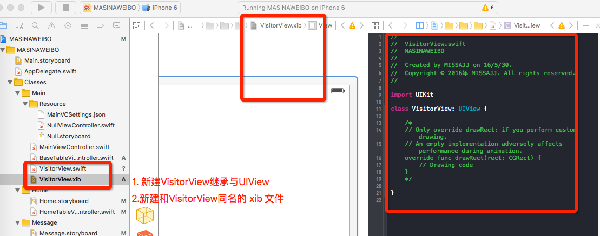
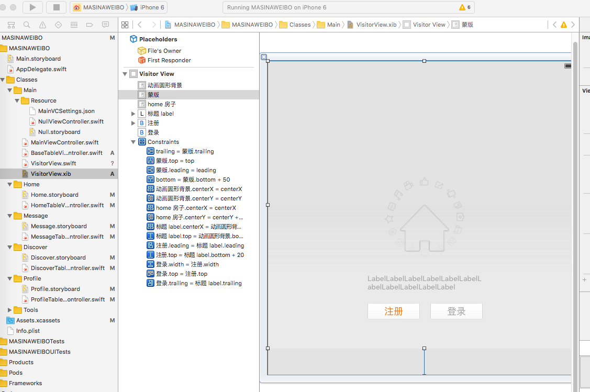
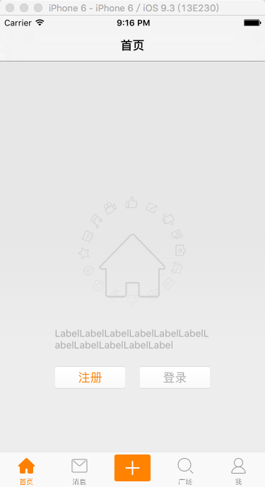

# 用户登录视图
---
```objc
Update更新：2016年5月30日 By {MISSAJJ琴瑟静听} 
```
> 对于第三方开发者，新浪没有开放未登录访问数据的权限，因此在用户登录之前，无法 `加载微博数据` 以及 `关注用户`

## 功能需求

* 用户登录操作视图，用于在用户没有登录时替换表格控制器的根视图
* 每个功能模块的登录视图包含以下四个控件
    * 模块图标
    * 描述文字
    * 注册按钮
    * 登录按钮
* 特例
    * 首页有一个小的转轮图片会不停旋转

## 功能实现

* 拖拽相关图片素材
* 新建 `VisitorView.swift` 继承自 `UIView`
* 新建 `VisitorView.xib`



### xib 创建登录视图

旋转动画是上边清晰,下边模糊暗淡的, 所以有一层蒙版遮盖着动画圆形背景
- 拖 ImageView 动画圆形背景进入视图, 按`command + =` 让图片显示默认大小,垂直水平都居中
- 拖 ImageView 蒙版 与上,左,右边距0,下边距为 50 (自己调试出来的)
- 拖 ImageView home 房子,垂直水平都居中,由于房子在动画圆形背景下方,所以Y轴多向下设置20
- 拖入 Label,按住` Control + 鼠标右键`移动到动画圆形背景,相对设置水平居中和顶部距离20, 固定宽为220,设置 lines 为0 
- 接着拖入 Button,设置为custom, 按钮文字为黄色的`注册`,按住` Control + 鼠标右键`移动到label, 设置左对齐,并设置间距为20, 设置宽为100
- 按住` option + 鼠标点住注册按钮`,复制一个新按钮,按钮名称改为`登录`,按住` Control + 右键`移动到label, 设置右对齐,并设置与`注册`按钮同宽
- 别忘了custom class 绑定 VisitorView



- 在VisitorView.swift内代码快速创建 Xib

```Swift 
//  VisitorView.swift
//  MASINAWEIBO 
//  Created by MISSAJJ on 16/5/30.
//  Copyright © 2016年 MISSAJJ. All rights reserved.
//

import UIKit 
class VisitorView: UIView {

    //    func 相当于 OC 中 -号开头的方法
    //    class func  相当于 OC 中 +号开头的方法
    
    //快速创建 xib
    class func visitorView() -> VisitorView { 
        return NSBundle.mainBundle().loadNibNamed("VisitorView", owner: nil, options: nil).last as! VisitorView 
    } 
} 
```
- 在 BaseTableViewController.swift 内改写代码

```Swift
//  BaseTableViewController.swift
//  MASINAWEIBO 
//  Created by MISSAJJ on 16/5/30.
//  Copyright © 2016年 MISSAJJ. All rights reserved.
//

import UIKit

class BaseTableViewController: UITableViewController {
    // 定义标记记录用户登录状态
    var  isLogin  = false 
    // 访客视图
    var visitorView: VisitorView? 
    
    override func loadView() {
        
        // 判断用户是否登录, 如果没有登录就显示访客界面, 如果已经登录就显示tableview
        
        isLogin ? super.loadView() : setupVisitorView()
        
    }
    
    // MARK: - 内部控制方法
    private func setupVisitorView()
    { 
        let otherView = VisitorView.visitorView()
        view = otherView  
    }
}
```

###模拟器截图




###纯代码创建登录视图
```swift
///  访客登录视图
class VisitorLoginView: UIView {

    override init(frame: CGRect) {
        super.init(frame: frame)

        backgroundColor = UIColor.redColor()
    }

    required init(coder aDecoder: NSCoder) {
        fatalError("init(coder:) has not been implemented")
    }
}
```

* 修改 `setupVisitorView` 函数

```swift
// 替换根视图
view = VisitorLoginView()
```

* 添加界面元素

```swift
///  设置 UI 控件
private func setupUI(){
        // 1. 添加控件
        addSubview(iconView)
        addSubview(homeIconView)
        addSubview(messageLabel)
        addSubview(registerButton)
        addSubview(loginButton)
    }

// MARK: - 界面元素懒加载
    /// 背景图标
    private lazy var iconView: UIImageView = {
        let iv = UIImageView(image: UIImage(named: "visitordiscover_feed_image_smallicon"))
        return iv
        }()

    /// 小房子
    private lazy var homeIconView: UIImageView = {
        let iv = UIImageView(image: UIImage(named: "visitordiscover_feed_image_house"))
        return iv
        }()

    /// 消息文字
    private lazy var messageLabel: UILabel = {
        let label = UILabel()
        label.text = "关注一些人，回这里看看有什么惊喜"
        return label
        }()

    /// 注册按钮
    private lazy var registerButton: UIButton = {
        let btn = UIButton()
        btn.setTitle("注册", forState: UIControlState.Normal)
        return btn
        }()

    /// 登录按钮
    private lazy var loginButton: UIButton = {
        let btn = UIButton()
        btn.setTitle("登录", forState: UIControlState.Normal)
        return btn
        }()
```

* 设置自动布局

```swift
    // 设置布局
        // 2.1背景图标
        iconView.xmg_AlignInner(type: XMG_AlignType.Center, referView: self, size: nil)

        // 2.3小房子
        homeIconView.xmg_AlignInner(type: XMG_AlignType.Center, referView: self, size: nil)
        // 2.4消息文字
        messageLabel.xmg_AlignVertical(type: XMG_AlignType.BottomCenter, referView: iconView, size: nil)
        addConstraint(NSLayoutConstraint(item: messageLabel, attribute: NSLayoutAttribute.Width, relatedBy: NSLayoutRelation.Equal, toItem: nil, attribute: NSLayoutAttribute.NotAnAttribute, multiplier: 1.0, constant: 224))
        // 2.5注册按钮
        registerButton.xmg_AlignVertical(type: XMG_AlignType.BottomLeft, referView: messageLabel, size: CGSize(width: 100, height: 35), offset: CGPoint(x: 0, y: 20))
        // 2.6登录按钮
        loginButton.xmg_AlignVertical(type: XMG_AlignType.BottomRight, referView: messageLabel, size: CGSize(width: 100, height: 35), offset: CGPoint(x: 0, y: 20))
```

* 懒加载方法补全

```swift
    /// 背景图标
    private lazy var iconView: UIImageView = {
        let iv = UIImageView(image: UIImage(named: "visitordiscover_feed_image_smallicon"))
        return iv
        }()

    /// 小房子
    private lazy var homeIconView: UIImageView = {
        let iv = UIImageView(image: UIImage(named: "visitordiscover_feed_image_house"))
        return iv
        }()

    /// 消息文字
    private lazy var messageLabel: UILabel = {
        let label = UILabel()
        label.text = "关注一些人，回这里看看有什么惊喜"
        label.textColor = UIColor.darkGrayColor()
        label.font = UIFont.systemFontOfSize(14)
        label.numberOfLines = 0
        label.sizeToFit()
        return label
        }()

    /// 注册按钮
    private lazy var registerButton: UIButton = {
        let btn = UIButton()
        btn.setTitle("注册", forState: UIControlState.Normal)
        btn.setBackgroundImage(UIImage(named: "common_button_white_disable"), forState: UIControlState.Normal)
        btn.setTitleColor(UIColor.orangeColor(), forState: UIControlState.Normal)
        return btn
        }()

    /// 登录按钮
    private lazy var loginButton: UIButton = {
        let btn = UIButton()
        btn.setTitle("登录", forState: UIControlState.Normal)
        btn.setBackgroundImage(UIImage(named: "common_button_white_disable"), forState: UIControlState.Normal)
        btn.setTitleColor(UIColor.orangeColor(), forState: UIControlState.Normal)
        return btn
        }()
```

* 按钮图片切片

* 添加遮罩图片

```swift
    /// 遮罩图片
    // 注意系统有一个叫做maskView的属性, 属性名称不能叫做maskView
    private lazy var maskIconView: UIImageView = {
        let iv = UIImageView(image: UIImage(named: "visitordiscover_feed_mask_smallicon"))

        return iv
        }()
```

* 遮罩图片自动布局

```swift
    // 2.2遮罩
    maskIconView.xmg_Fill(self)
```

* 视图背景颜色

```swift
backgroundColor = UIColor(white: 237.0 / 255.0, alpha: 1.0)
```

> 运行测试
