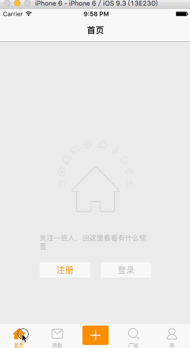

# 登录视图代码实现

---
```objc
Update更新：2016年5月30日 By {MISSAJJ琴瑟静听} 
```

###BaseTableViewController.swift的代码调整
```Swift
//
//  BaseTableViewController.swift
//  MASINAWEIBO
//
//  Created by MISSAJJ on 16/5/30.
//  Copyright © 2016年 MISSAJJ. All rights reserved.
//

import UIKit

class BaseTableViewController: UITableViewController {
    
    // 定义标记记录用户登录状态
    var  isLogin  = false
    // 访客视图
    var visitorView: VisitorView?
    
    override func loadView() {
        
        // 判断用户是否登录, 如果没有登录就显示访客界面, 如果已经登录就显示tableview
        
        isLogin ? super.loadView() : setupVisitorView()
        
    }
    
    // MARK: - 内部控制方法
    private func setupVisitorView()
    {
        //设置访客视图:很重要,否则视图的数据将显示不出来
        visitorView = VisitorView.visitorView()
        view = visitorView
    }
}

```

### xib 拉线后设置视图上的数据
```Swift
 
//  VisitorView.swift
//  MASINAWEIBO
//
//  Created by MISSAJJ on 16/5/30.
//  Copyright © 2016年 MISSAJJ. All rights reserved.
//

import UIKit

class VisitorView: UIView {
    
    
    
    // 注册按钮
    @IBOutlet weak var registerButton: UIButton!
    // 登录按钮
    @IBOutlet weak var loginButton: UIButton!
    // 动画转盘
    @IBOutlet weak var rotationImageView: UIImageView!
    // 图标
    @IBOutlet weak var iconImageView: UIImageView!
    // 文本标签
    @IBOutlet weak var titleLabel: UILabel!
    
    
    //设置访客视图上的数据imageName需要显示的图标 , title需要显示的标题
    //home的imageName 是 xib 里设置的不需要另外设置,所以设置 nil 就可以了,所以是 string? 可选状态
    func setupVisitorInfo(imageName: String? , title: String)
    {
        // 1.设置标题
        titleLabel.text = title
        
        // 2.判断是否是首页 (String?为可选,所以要通过 guard 判定)
        guard let name = imageName else
        {
            // 没有设置图标为->首页
            // 执行转盘动画
            startAnimation()
            
            return
        }
        
        // 3.设置其他数据
        // 不是首页
        rotationImageView.hidden = true
        
        iconImageView.image = UIImage(named: name)
        
    } 
    private func startAnimation()
    {
        
        // 1.创建旋转动画transform.rotation
        let anim =  CABasicAnimation(keyPath: "transform.rotation")
        
        // 2.设置动画属性
        anim.toValue = 2 * M_PI
        anim.duration = 5.0
        anim.repeatCount = MAXFLOAT
        
        // 注意: 默认情况下只要视图消失, 系统就会自动移除动画
        // 只要设置removedOnCompletion为false, 系统就不会移除动画
        anim.removedOnCompletion = false
        
        // 3.将动画添加到图层上
        rotationImageView.layer.addAnimation(anim, forKey: nil)

        
    }
    
    
    //    func 相当于 OC 中 -号开头的方法
    //    class func  相当于 OC 中 +号开头的方法
    
    //快速创建 xib
    class func visitorView() -> VisitorView {
        
        return NSBundle.mainBundle().loadNibNamed("VisitorView", owner: nil, options: nil).last as! VisitorView
        
    }
}

```
## 修改功能视图控制器中的代码

* HomeTableViewController

```swift
import UIKit

class HomeTableViewController: BaseTableViewController {

    override func viewDidLoad() {
        super.viewDidLoad()
        
        // 1.判断用户是否登录
        if !isLogin
        {
            // 设置访客视图
            visitorView?.setupVisitorInfo(nil, title: "关注一些人，回这里看看有什么惊喜")
            return
        }
    }

}
```

* MessageTableViewController

```swift
import UIKit

class MessageTableViewController: BaseTableViewController {

    override func viewDidLoad() {
        super.viewDidLoad()
        if !isLogin
        {
            visitorView?.setupVisitorInfo("visitordiscover_image_message", title: "登录后，别人评论你的微博，发给你的消息，都会在这里收到通知")
            return
        }
    }
   
}
```

* DiscoverTableViewController

```swift
import UIKit

class DiscoverTableViewController: BaseTableViewController {

    override func viewDidLoad() {
        super.viewDidLoad()
        if !isLogin
        {
            visitorView?.setupVisitorInfo("visitordiscover_image_message", title: "登录后，最新、最热微博尽在掌握，不再会与实事潮流擦肩而过")
            return
        }
    }

}
```

* ProfileTableViewController

```swift
import UIKit

class ProfileTableViewController: BaseTableViewController {

    override func viewDidLoad() {
        super.viewDidLoad()
        if !isLogin
        {
            visitorView?.setupVisitorInfo("visitordiscover_image_profile", title: "登录后，你的微博、相册、个人资料会显示在这里，展示给别人")
            return
        }
    }

}

```

###模拟器动画演示图




###设置访客视图信息的另一种方式: isHome: Bool

```swift
///  设置访客视图信息
///
///  :param: iconName 图标名称
///  :param: message  消息文字
///  :param: isHome   是否首页
func setupVisitorInfo(isHome: Bool, imageName: String, message: String){
        iconView.hidden = !isHome
        messageLabel.text = message
        homeIconView.image = UIImage(named: imageName)
    }
```

* 在 `BaseTableViewController` 中添加登录视图属性

```swift
/// 访客登录视图
var visitorLoginView: VisitorLoginView?
```

* 在 `setupVisitorView` 中记录登录视图

```swift
// 替换根视图
visitorLoginView = VisitorLoginView()
view = visitorLoginView
```

## 修改功能视图控制器中的代码

* HomeTableViewController

```swift
visitorView?.setupVisitorInfo(true, imageName: "visitordiscover_feed_image_house", message: "关注一些人，回这里看看有什么惊喜")
```

* MessageTableViewController

```swift
visitorView?.setupVisitorInfo(false, imageName: "visitordiscover_image_message", message: "登录后，别人评论你的微博，发给你的消息，都会在这里收到通知")
```

* DiscoverTableViewController

```swift
visitorView?.setupVisitorInfo(false, imageName: "visitordiscover_image_message", message: "登录后，最新、最热微博尽在掌握，不再会与实事潮流擦肩而过")
```

* ProfileTableViewController

```swift
visitorView?.setupVisitorInfo(false, imageName: "visitordiscover_image_profile", message: "登录后，你的微博、相册、个人资料会显示在这里，展示给别人")
```

